# Wazuh Server Deployment & Telemetry Configuration

## Overview

This stage focused on building the foundation of my Wazuh security monitoring environment from the ground up.

I configured the virtualization environment, deployed an Ubuntu Server virtual machine, installed Wazuh, validated the required services, confirmed access to the Wazuh dashboard, and enabled archive logging so that the environment could retain and expose telemetry for later analysis.

By the end of this stage, I had a functioning Wazuh server with searchable archive events available through the Wazuh dashboard.

---

## Lab Environment

| Component             | Configuration           |
| --------------------- | ----------------------- |
| Hypervisor            | VMware Workstation Pro  |
| Wazuh Server OS       | Ubuntu Server 24.04 LTS |
| Security Platform     | Wazuh                   |
| Remote Administration | OpenSSH / SSH           |
| Host Administration   | PowerShell              |
| Log Forwarding        | Filebeat                |

A Windows endpoint was also prepared for later integration with the Wazuh environment.

---

## 1. VMware Workstation Pro Installation

I used VMware Workstation Pro as the hypervisor for the on-premises lab.

After downloading the installer, I verified the integrity of the downloaded file by calculating its MD5 hash in PowerShell and comparing the result with the hash provided by the download source.

```powershell
Get-FileHash <installer-file> -Algorithm MD5
```

The calculated hash matched the published value, confirming the integrity of the downloaded installer before installation.

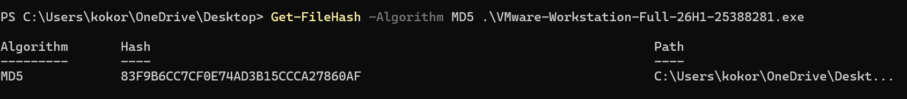

### Why I Validated the Hash

Checking the file hash provided a basic integrity check before executing the downloaded installer.

A matching hash confirmed that the file I downloaded matched the expected file associated with the published checksum.

---

## 2. Wazuh Server Virtual Machine

I downloaded Ubuntu Server 24.04 LTS and created a dedicated virtual machine for the Wazuh server.

The virtual machine was named:

```text
Wazuh-server
```

The VM was configured with resources appropriate for running the Wazuh components used in this lab.

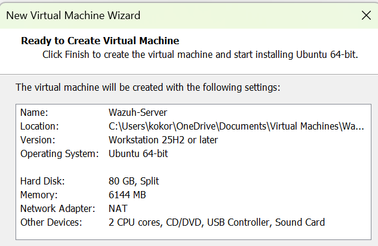

After Ubuntu Server installation, I installed OpenSSH Server to allow remote administration of the Wazuh server from the host system.

---

## 3. Ubuntu Server Validation

After completing the Ubuntu installation, I verified the server configuration and operating system information.

```bash
hostnamectl
```

This confirmed the operating system and hostname of the newly deployed server.

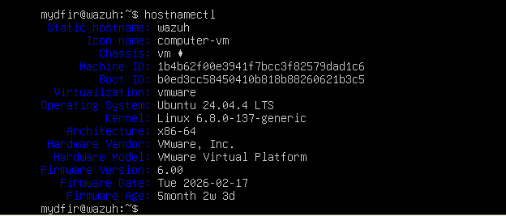

The server was assigned an IP address on the local lab network.

> The IP address shown in this documentation represents an internal lab address and may change as the environment evolves.

---

## 4. Remote Administration Using SSH

Rather than performing all administration directly through the VMware console, I connected to the Ubuntu server from the host machine using PowerShell and SSH.

```powershell
ssh <username>@<wazuh-server-ip>
```

This provided remote terminal access to the Wazuh server and allowed the remaining configuration to be performed from the host system.

---

## 5. Updating Ubuntu

Before installing Wazuh, I updated the Ubuntu package repositories and installed available package upgrades.

```bash
sudo apt-get update
sudo apt-get upgrade -y
```

This ensured that the server was running current packages before the Wazuh installation.

---

## 6. Wazuh Installation

I used the Wazuh Quickstart installation method to deploy the platform on the Ubuntu server.

After the installation completed, the terminal confirmed that Wazuh had been installed successfully.

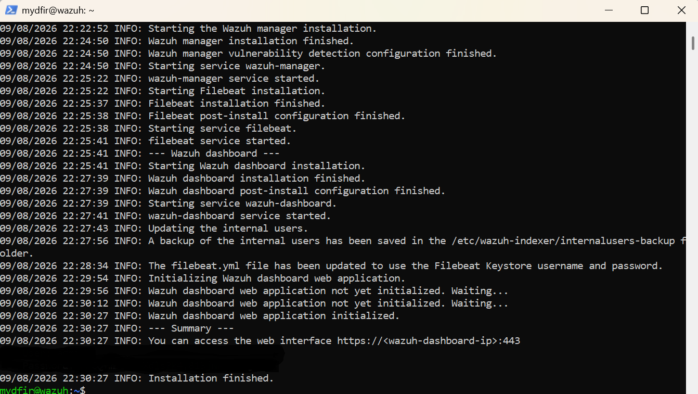

> **Security Note:** Administrative credentials generated during installation were removed or redacted from screenshots before publication.

---

## 7. Wazuh Service Validation

After completing the installation and configuration, I independently verified the status of the Wazuh Manager and Filebeat services rather than relying only on the installation completion message.

### Wazuh Manager

I verified the Wazuh Manager service using:

```bash
sudo systemctl status wazuh-manager
```

The service returned an **active (running)** status.

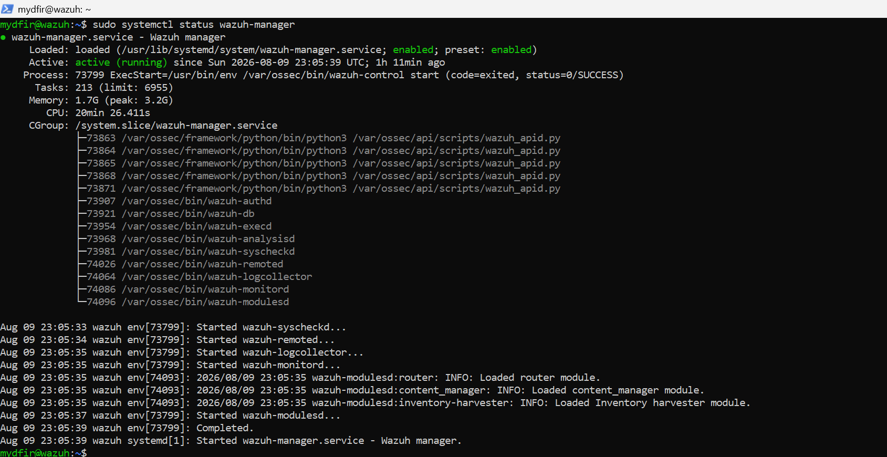

This confirmed that the Wazuh Manager was operational and available to process security data received by the platform.

### Filebeat

I separately verified the Filebeat service using:

```bash
sudo systemctl status filebeat
```

Filebeat also returned an **active (running)** status.

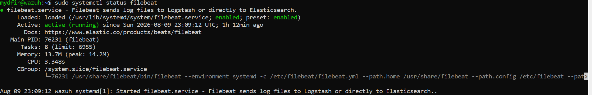

This confirmed that Filebeat was operational and available to forward Wazuh event data for indexing.

### Validation Result

Both server-side services required for this part of the telemetry pipeline were confirmed operational:

```text
Wazuh Manager
     │
     │ Processes security data
     ▼
   Alerts / Archives
     │
     ▼
   Filebeat
     │
     │ Forwards data
     ▼
 Wazuh Indexer
```

Validating the services independently provided stronger evidence that the server-side telemetry pipeline was operational before I moved on to dashboard and event validation.

---

## 8. Dashboard Validation

After installation, I accessed the Wazuh dashboard through the server's HTTPS interface.

```text
https://<wazuh-server-ip>
```

I authenticated to the dashboard and confirmed that the Wazuh interface loaded successfully.

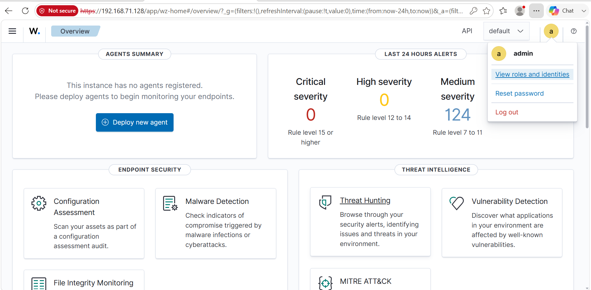

This provided another validation point that the Wazuh deployment was operational and accessible from the host system.

---

## 9. Initial Event Visibility

I opened the Discover interface and reviewed the available events using the Wazuh alerts index.

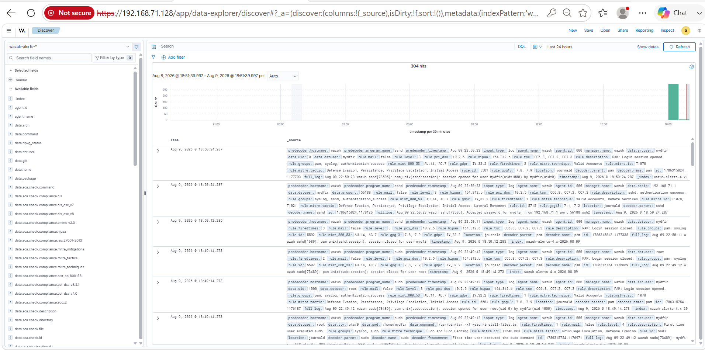

This confirmed that Wazuh was generating and indexing alert data that could be searched through the dashboard.

However, alerts alone were not sufficient for the telemetry analysis I wanted to perform later in the lab.

I therefore enabled Wazuh archive logging.

---

# Enabling Wazuh Archive Logging

## 10. Wazuh Manager Configuration

I navigated to the Wazuh configuration directory:

```bash
cd /var/ossec/etc
```

I then edited:

```text
ossec.conf
```

The archive logging options were configured as:

```xml
<logall>yes</logall>
<logall_json>yes</logall_json>
```

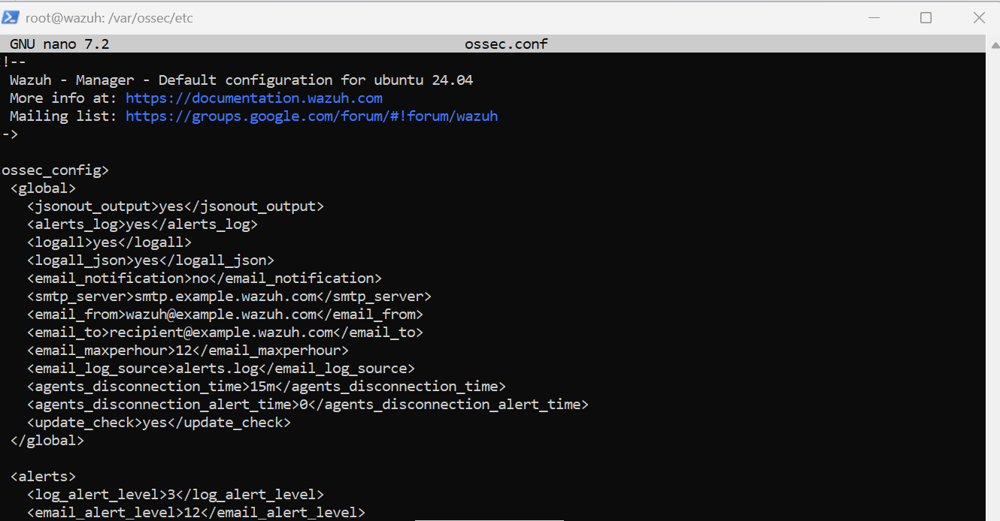

Enabling these settings allows Wazuh to retain events beyond only those that generate alerts.

This distinction is important for later threat hunting and investigation because activity that does not trigger a detection rule may still contain useful security evidence.

After modifying the configuration, I restarted the Wazuh Manager service:

```bash
sudo systemctl restart wazuh-manager.service
```

---

## 11. Filebeat Archive Configuration

Archive data also needed to be forwarded for indexing.

I edited the Filebeat configuration:

```bash
sudo nano /etc/filebeat/filebeat.yml
```

Within the Wazuh module configuration, I enabled archive forwarding.

```yaml
archives:
  enabled: true
```

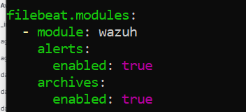

I then restarted Filebeat:

```bash
sudo systemctl restart filebeat
```

This applied the updated configuration.

---

## 12. Creating the Wazuh Archives Index Pattern

With archive collection and forwarding enabled, I returned to the Wazuh dashboard and created an index pattern for the archive data.

The pattern was configured for:

```text
wazuh-archives-*
```

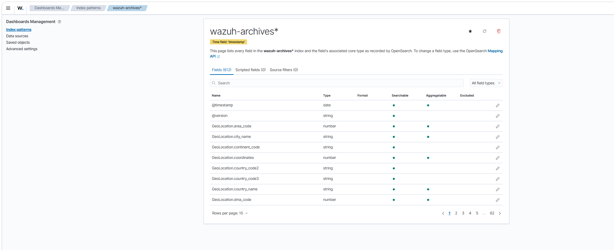

This made the archive data searchable through the Discover interface.

---

## 13. Archive Telemetry Validation

Finally, I switched the Discover view from the Wazuh alerts index to the Wazuh archives index.

Events were visible within the new index.

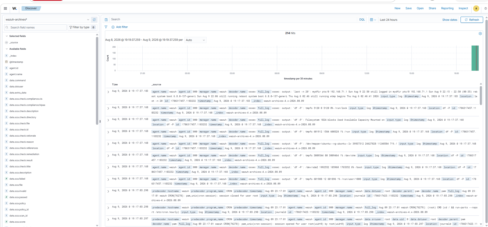

This was the final validation for this stage.

The resulting telemetry flow was:

```text
System Activity
      ↓
Wazuh Collection
      ↓
Wazuh Manager
      ↓
Archive Logging
      ↓
Filebeat
      ↓
Wazuh Indexer
      ↓
Discover
```

---

# What I Built

At the end of this stage, I had:

* Deployed an Ubuntu Server virtual machine using VMware Workstation Pro
* Established SSH administration from the host system
* Installed the Wazuh platform
* Verified the Wazuh Manager and Filebeat services were active
* Successfully accessed the Wazuh dashboard
* Verified initial Wazuh alert visibility
* Enabled Wazuh archive logging
* Configured Filebeat to forward archive events
* Created the `wazuh-archives-*` index pattern
* Verified that archive telemetry was searchable through Discover

---

# Validation Summary

I validated the deployment progressively rather than relying on a single successful installation message.

```text
Ubuntu Server Operational
        ↓
SSH Connectivity Established
        ↓
Wazuh Installation Completed
        ↓
Wazuh Manager Active
        ↓
Filebeat Active
        ↓
Dashboard Accessible
        ↓
Alert Data Visible
        ↓
Archive Logging Enabled
        ↓
Archive Events Searchable
```

This layered validation provides clearer troubleshooting boundaries if telemetry becomes unavailable later in the environment.

---

# Security Operations Takeaway

The most important result from this stage was not simply getting the Wazuh dashboard online.

Enabling archive logging established greater visibility into the telemetry collected by the environment.

Alert data represents activity that matched configured detection logic, while archived events provide additional underlying telemetry that may be required during threat hunting and investigation.

This distinction matters because:

> **The absence of an alert does not necessarily mean the absence of security-relevant activity.**

Being able to search the underlying telemetry provides additional evidence when validating detections, investigating suspicious behavior, or determining what occurred on a monitored system.

---

# Troubleshooting & Lessons Learned

This stage reinforced the importance of validating each layer independently rather than assuming that a successful installation means the entire telemetry pipeline is working.

The deployment was validated progressively:

1. Ubuntu Server operational
2. Remote SSH connectivity established
3. Wazuh installation completed
4. Wazuh Manager service active
5. Filebeat service active
6. Dashboard accessible
7. Alert data visible
8. Archive logging enabled
9. Filebeat archive forwarding enabled
10. Archive index created
11. Archive events searchable

This approach provides clear troubleshooting boundaries.

For example:

* If the dashboard is unavailable, I can investigate the platform or network layer.
* If the dashboard works but events are missing, I can investigate ingestion and indexing.
* If alerts exist but raw telemetry is unavailable, I can investigate archive logging and Filebeat configuration.

---

# Recovery Point

After completing and validating the configuration, I created a VMware snapshot named:

```text
Wazuh configuration
```

This provides a known-good recovery point before additional endpoints, telemetry sources, and detection configurations are introduced.

---

# Stage Conclusion

This stage established the server-side foundation of the Wazuh security monitoring environment.

The server was successfully deployed, the required services were validated, alert data was visible, and archive logging was configured so that underlying telemetry could be searched through Wazuh.

The environment is now ready for endpoint integration.

---

## Next Stage

The next implementation stage will focus on connecting Windows and Linux endpoints to the Wazuh server and validating that endpoint telemetry is successfully collected and searchable.

