# Windows & Linux Endpoint Integration with Sysmon

## Overview

This stage extended the Wazuh environment from a standalone server into a monitored multi-endpoint lab.

I deployed dedicated Windows and Ubuntu virtual machines, installed Wazuh agents on both endpoints, validated their connection to the Wazuh server, installed Sysmon on both operating systems, and configured the environment so that Sysmon telemetry became searchable through Wazuh.

By the end of this stage, both endpoints were actively communicating with the Wazuh server and generating searchable endpoint telemetry.

---

## Lab Environment

| System           | Role                            | IP Address       |
| ---------------- | ------------------------------- | ---------------- |
| Wazuh Server     | Centralized security monitoring | `192.168.71.128` |
| Ubuntu Endpoint  | Linux monitored endpoint        | `192.168.71.129` |
| Windows Endpoint | Windows monitored endpoint      | `192.168.71.130` |

The endpoint agents were registered in Wazuh as:

```text
MYDFIR-Windows
MYDFIR-Linux
```

---

# Endpoint Deployment

## 1. Ubuntu Endpoint Deployment

I created a second Ubuntu Server virtual machine using VMware Workstation Pro.

The virtual machine was configured with:

```text
Memory: 3096 MB
Disk:   30 GB
CPU:    VMware default configuration
OS:     Ubuntu Server 24.04 LTS
```

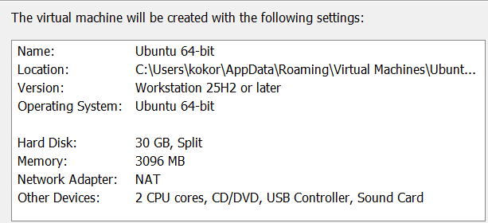

After completing the installation, I validated the operating system and hostname using:

```bash
hostnamectl
```

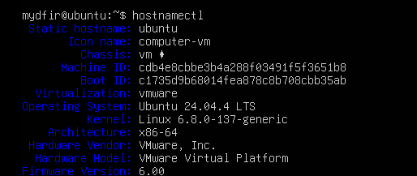

The Ubuntu endpoint was assigned the following address on the internal lab network:

```text
192.168.71.129
```

---

## 2. Windows Endpoint Deployment

I created a dedicated Windows virtual machine using the Windows installation media prepared during the previous stage.

The virtual machine was configured with:

```text
Memory: 3096 MB
Disk:   50 GB
CPU:    VMware default configuration
OS:     Windows 10
```

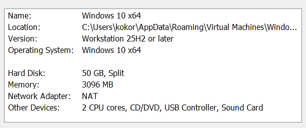

After installation, I verified the endpoint's network configuration using:

```powershell
ipconfig
```

The Windows endpoint was assigned:

```text
192.168.71.130
```

I also enabled Remote Desktop so that I could administer the Windows endpoint from the host system.

---

## 3. Virtual Lab Validation

At this point, the VMware environment contained the three systems required for the lab:

```text
Wazuh Server
Ubuntu Endpoint
Windows Endpoint
```

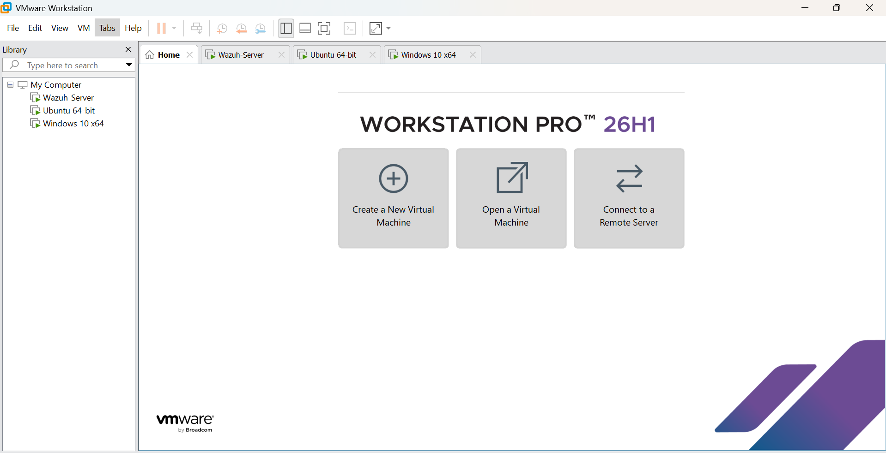

This established the virtualized environment that would be used for centralized Windows and Linux endpoint monitoring.

---

# Wazuh Agent Deployment

## 4. Windows Wazuh Agent

From the Wazuh dashboard, I selected **Deploy New Agent** and configured the Windows endpoint.

The Wazuh server address was:

```text
192.168.71.128
```

The Windows agent was named:

```text
MYDFIR-Windows
```

I executed the Wazuh-provided deployment command from PowerShell on the Windows endpoint:

```powershell
Invoke-WebRequest -Uri https://packages.wazuh.com/4.x/windows/wazuh-agent-4.14.7-1.msi -OutFile $env:tmp\wazuh-agent; msiexec.exe /i $env:tmp\wazuh-agent /q WAZUH_MANAGER='192.168.71.128' WAZUH_AGENT_NAME='MYDFIR-Windows'
```

This downloaded and installed Wazuh Agent version `4.14.7-1` and configured the agent to communicate with the Wazuh server at `192.168.71.128`.

After installation, I started the Wazuh agent service:

```powershell
net start Wazuh
```

The terminal confirmed that the Wazuh service started successfully.

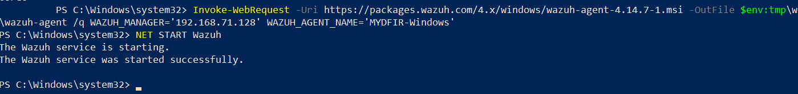

---

## 5. Linux Wazuh Agent

I repeated the agent deployment process for the Ubuntu endpoint.

From **Deploy New Agent**, I selected:

```text
Linux
DEB amd64
```

The Wazuh server address was:

```text
192.168.71.128
```

The Linux agent was named:

```text
MYDFIR-Linux
```

I connected to the Ubuntu endpoint through SSH and executed the Wazuh-provided installation command:

```bash
wget https://packages.wazuh.com/4.x/apt/pool/main/w/wazuh-agent/wazuh-agent_4.14.7-1_amd64.deb && sudo WAZUH_MANAGER='192.168.71.128' WAZUH_AGENT_NAME='MYDFIR-Linux' dpkg -i ./wazuh-agent_4.14.7-1_amd64.deb
```

I then reloaded the systemd configuration, enabled the Wazuh agent to start automatically, and started the service:

```bash
sudo systemctl daemon-reload
sudo systemctl enable wazuh-agent
sudo systemctl start wazuh-agent
```

This configured the Ubuntu endpoint to communicate with the Wazuh server and configured the Wazuh agent to start automatically after a system reboot.

---

## 6. Agent Connectivity Validation

After deploying both agents, I returned to the Wazuh agent inventory.

Both endpoints appeared as active:

```text
MYDFIR-Windows
MYDFIR-Linux
```

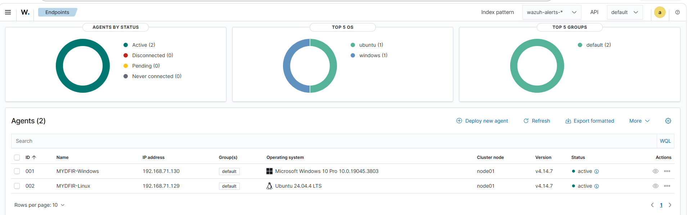

This provided server-side confirmation that both endpoint agents had established communication with the Wazuh server.

---

## 7. Initial Endpoint Telemetry Validation

I opened **Discover** and selected the `wazuh-archives-*` index configured during the previous stage.

Using the `agent.name` field, I reviewed the available endpoint data and confirmed that events were associated with both monitored endpoints:

```text
MYDFIR-Windows
MYDFIR-Linux
```

At this point, the agents were connected and endpoint data was reaching the centralized Wazuh environment.

The next objective was to improve endpoint visibility by adding Sysmon telemetry.

---

# Windows Sysmon Integration

## 8. Installing Sysmon on Windows

On the Windows endpoint, I downloaded Microsoft Sysmon.

I also downloaded a Sysmon configuration file based on the Olaf configuration project and saved the XML configuration file locally.

After extracting Sysmon, I placed the configuration file in the Sysmon directory.

From PowerShell, I navigated to the directory containing the Sysmon executable and configuration file.

I then installed Sysmon using the configuration:

```powershell
.\Sysmon.exe -i .\sysmonconfig.xml
```

The installation completed successfully and Sysmon started.

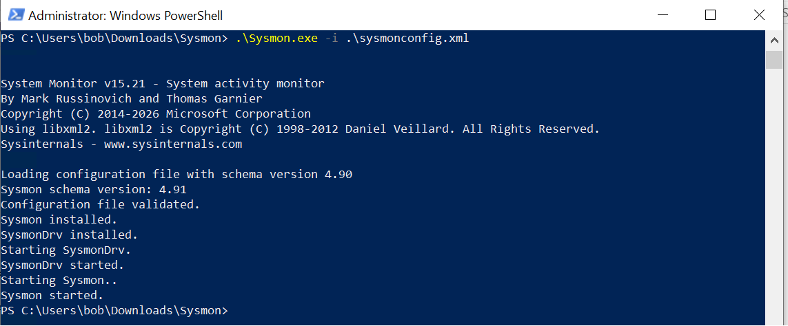

---

## 9. Windows Sysmon Service Validation

I independently verified the Sysmon installation through Windows Services.

The Sysmon service showed a running state.


This confirmed that Sysmon was installed and operational locally on the Windows endpoint.

---

# Identifying a Windows Telemetry Gap

## 10. Initial Sysmon Search in Wazuh

After installing Sysmon, I returned to Wazuh Discover and filtered the data for:

```text
MYDFIR-Windows
```

I then searched the available telemetry for Sysmon-related activity.

The initial search returned only one hit.

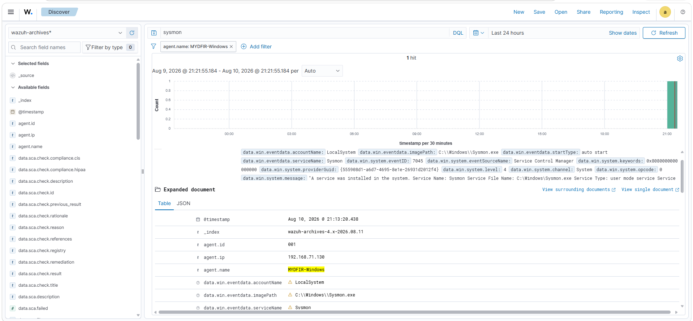

Sysmon was installed and running locally, but the expected Sysmon Operational telemetry was not yet appearing in Wazuh.

This identified a collection gap.

The problem was not that Sysmon had failed to install. Wazuh still needed to be configured to collect the Sysmon event channel.

---

# Configuring the Windows Wazuh Agent for Sysmon

## 11. Identifying the Sysmon Event Channel

I reviewed the Windows Event Viewer and located Sysmon under:

```text
Applications and Services Logs
└── Microsoft
    └── Windows
        └── Sysmon
            └── Operational
```

The complete event channel name was:

```text
Microsoft-Windows-Sysmon/Operational
```

---

## 12. Updating the Windows Agent Configuration

I opened the Wazuh agent `ossec.conf` configuration file on the Windows endpoint.

The existing configuration contained `localfile` entries defining which Windows event channels the agent collected.

There was initially no entry for the Sysmon Operational channel.

I added a configuration entry using:

```text
Microsoft-Windows-Sysmon/Operational
```

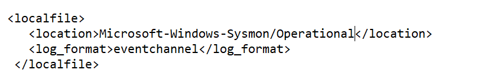

After saving the configuration, I restarted the Wazuh agent service so that the new collection configuration would take effect.

---

# Windows Sysmon Telemetry Validation

## 13. Confirming Sysmon Events in Wazuh

After restarting the Wazuh agent, I returned to Discover and refreshed the Windows endpoint search.

The search now returned significantly more Sysmon-related events.

I expanded an event and reviewed the available fields.

The event contained:

```text
data.win.system.channel:
Microsoft-Windows-Sysmon/Operational
```

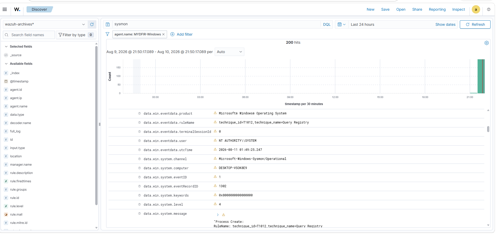

This provided direct evidence that Windows Sysmon telemetry was now being collected by the Wazuh agent and made searchable through Wazuh.

The resulting Windows telemetry path was:

```text
Windows Activity
       ↓
     Sysmon
       ↓
Windows Event Log
       ↓
  Wazuh Agent
       ↓
  Wazuh Server
       ↓
    Indexer
       ↓
    Discover
```

---

# Sysmon for Linux Integration

## 14. Installing Sysmon for Linux

I then configured Sysmon on the Ubuntu endpoint.

I connected to the Ubuntu endpoint through SSH and followed the Sysmon for Linux installation process.

I updated the Ubuntu package information and installed Sysmon for Linux:

```bash
sudo apt-get update
sudo apt-get install sysmonforlinux
```

I also downloaded the Sysmon for Linux configuration used for this lab.

The configuration file was:

```text
collect-all.xml
```

After downloading the configuration, I installed Sysmon using:

```bash
sudo sysmon -i collect-all.xml
```

The installation completed successfully.

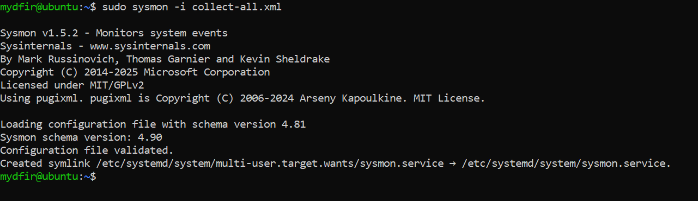

---

# Linux Sysmon Telemetry Validation

## 15. Confirming Linux Sysmon Telemetry

I returned to Wazuh Discover and changed the endpoint filter from:

```text
MYDFIR-Windows
```

to:

```text
MYDFIR-Linux
```

After refreshing the search, Linux events were visible.

I expanded one of the events and reviewed the available fields.

The resulting data contained Sysmon-related information, including an event ID.

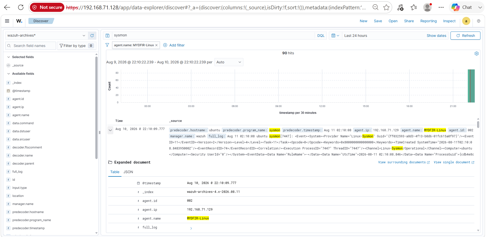

This provided evidence that telemetry associated with Sysmon for Linux was reaching the centralized Wazuh environment.

---

# End-to-End Telemetry Test

## 16. Generating Test Activity

To perform a simple validation of the Linux telemetry path, I executed:

```bash
uname
```

on the Ubuntu endpoint.

I then returned to Wazuh Discover and refreshed the Linux endpoint search.

The latest telemetry contained the generated command activity.

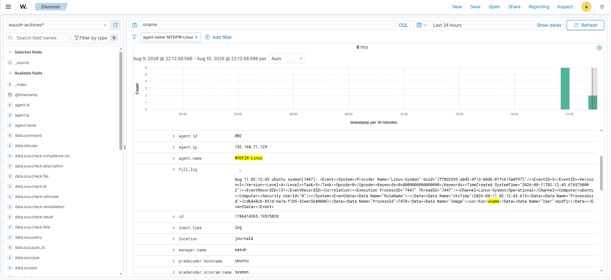

This provided a simple end-to-end validation:

```text
Command Executed
      ↓
Endpoint Activity
      ↓
Telemetry Generated
      ↓
Wazuh Agent Collection
      ↓
Wazuh Server
      ↓
Indexed Telemetry
      ↓
Discover
      ↓
Activity Located
```

Rather than relying only on the agent showing an active state, this demonstrated that activity generated on the endpoint could subsequently be located within the centralized telemetry.

---

# What I Built

At the end of this stage, I had:

* Deployed dedicated Windows and Ubuntu endpoints
* Connected both endpoints to the Wazuh server
* Verified both Wazuh agents were active
* Confirmed endpoint data was reaching Wazuh
* Installed Sysmon on Windows
* Verified the Windows Sysmon service was running
* Identified that expected Windows Sysmon telemetry was initially not being collected
* Configured the Windows Wazuh agent to collect the Sysmon Operational event channel
* Verified Windows Sysmon telemetry in Wazuh
* Installed Sysmon for Linux
* Verified Linux Sysmon-related telemetry in Wazuh
* Generated test activity on the Ubuntu endpoint
* Located the resulting activity within Wazuh

---

# Validation Summary

I validated the implementation progressively:

```text
Windows & Ubuntu VMs Operational
             ↓
       Wazuh Agents Installed
             ↓
        Agents Active
             ↓
   Endpoint Data Searchable
             ↓
       Sysmon Installed
             ↓
 Windows Sysmon Validated
             ↓
 Collection Gap Identified
             ↓
 Wazuh Agent Config Updated
             ↓
Windows Sysmon Events Searchable
             ↓
Linux Sysmon Installed
             ↓
Linux Telemetry Searchable
             ↓
 Test Activity Generated
             ↓
 Activity Located in Wazuh
```

---

# Key Finding

The most useful finding during this stage was the Windows Sysmon collection gap.

Sysmon was successfully installed and running on the Windows endpoint, but the expected Sysmon Operational telemetry was not initially available in Wazuh.

The missing layer was the Wazuh agent collection configuration.

After adding:

```text
Microsoft-Windows-Sysmon/Operational
```

to the agent configuration and restarting the Wazuh agent, Sysmon events became available in Discover.

This demonstrated that:

> **Endpoint visibility depends on both telemetry generation and correct collection configuration.**

A telemetry source can be operational locally while remaining invisible to centralized monitoring if the required event source is not being collected.

---

# Security Operations Takeaway

This stage moved the environment beyond simply showing that endpoints were connected.

I validated three different layers:

1. **Agent connectivity** — Wazuh showed both endpoint agents as active.
2. **Telemetry collection** — endpoint data was searchable centrally.
3. **Telemetry source validation** — Sysmon-generated information could be identified within Wazuh.

This distinction is important when troubleshooting monitoring gaps.

An active agent does not prove that every required telemetry source is being collected.

If an endpoint is connected but expected events are missing, the investigation must continue into the telemetry source, event channel, collection configuration, and indexing path.

---

# Evidence vs. Conclusion

| Evidence                                                | Supported Conclusion                                                     |
| ------------------------------------------------------- | ------------------------------------------------------------------------ |
| Both agents displayed as active                         | Windows and Linux agents established communication with the Wazuh server |
| Sysmon running in Windows Services                      | Sysmon was operational locally on the Windows endpoint                   |
| `Microsoft-Windows-Sysmon/Operational` visible in Wazuh | Windows Sysmon telemetry was successfully collected                      |
| Linux Sysmon-related event data visible                 | Sysmon-related Linux telemetry reached Wazuh                             |
| `uname` activity located after execution                | Generated Linux activity could be traced into centralized telemetry      |

The evidence does **not** yet establish that the environment can reliably detect malicious activity.

That requires generating controlled activity, analyzing the resulting events, identifying useful fields, and evaluating how the available telemetry could support detection and investigation.

---

# Stage Conclusion

This stage established endpoint-level visibility across the Windows and Ubuntu systems.

Both endpoints were successfully connected to the Wazuh server, Sysmon was introduced as an additional telemetry source, and the resulting endpoint activity was validated through Wazuh Discover.

The environment is now ready to move from **telemetry collection** into **telemetry analysis**.

---

## Next Stage

The next stage will focus on generating controlled activity on the monitored endpoints and analyzing the resulting telemetry to determine:

* What events are generated
* Which fields provide useful investigative context
* How Windows and Linux activity appears in Wazuh
* What the collected evidence proves
* What cannot be concluded from the available telemetry alone
