# Telemetry Generation & Security Event Analysis

## Overview

In this stage, I moved from validating telemetry collection to actively generating endpoint activity and analyzing the resulting security events in Wazuh.

I generated controlled Windows account-management activity and Linux SSH authentication activity, then used Wazuh Discover to identify and review the resulting telemetry.

The objective was to understand how endpoint actions appear in centralized logs and how fields such as event IDs, usernames, source addresses, process identifiers, session identifiers, and timestamps can be used to reconstruct activity.

---

## Lab Systems Used

| System | Role | IP Address |
|---|---|---|
| Wazuh Server | Centralized security monitoring | `192.168.71.128` |
| Ubuntu Endpoint | Linux monitored endpoint | `192.168.71.129` |
| Windows Endpoint | Windows monitored endpoint | `192.168.71.130` |

---

# Windows Activity Generation

## 1. Establishing Endpoint Context

I connected to the Windows endpoint through RDP and opened Command Prompt with administrative privileges.

Before generating account-management activity, I collected basic system, network, and account information.

### Current User

```cmd
whoami
```

### Network Configuration

```cmd
ipconfig /all
```

This provided information about the endpoint's network adapters, IPv4 configuration, subnet mask, and default gateway.

### Local User Accounts

```cmd
net user
```

This displayed the local user accounts configured on the Windows endpoint.

### Local Administrators

```cmd
net localgroup administrators
```

This allowed me to review the accounts belonging to the local Administrators group.

---

# Windows Account Activity

## 2. Enabling the Guest Account

Before making the change, I opened Computer Management and verified that the built-in Guest account was disabled.

I then enabled the Guest account:

```cmd
net user guest /active:yes
```

I returned to Computer Management and confirmed that the Guest account was now enabled.

---

## 3. Changing the Guest Account Password

I changed the password associated with the Guest account:

```cmd
net user guest <LAB-PASSWORD>
```

> **Security Note:** Lab credentials are intentionally omitted from this public documentation.

---

## 4. Creating a Local User

I generated additional account-management telemetry by creating a temporary local account named `Student1`.

```cmd
net user Student1 <LAB-PASSWORD> /add
```

The account was successfully created.

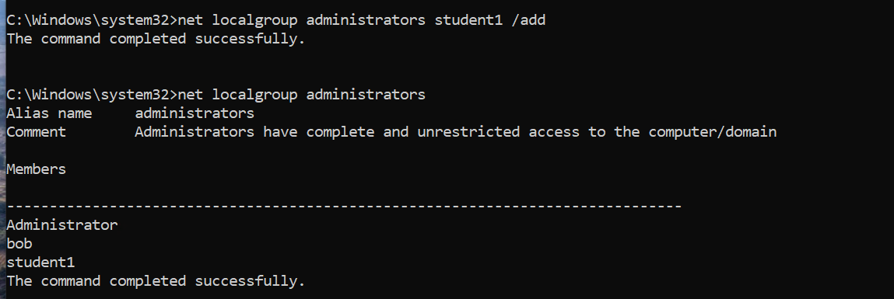

---

## 5. Adding the User to the Administrators Group

I added `Student1` to the local Administrators group:

```cmd
net localgroup administrators Student1 /add
```

This generated privileged group-membership activity that could subsequently be reviewed through the Windows security telemetry collected by Wazuh.

---

## 6. Deleting the Account

After generating the required activity, I deleted the temporary account:

```cmd
net user Student1 /delete
```

With the controlled account activity complete, I moved to Wazuh to identify how these actions appeared in the collected telemetry.

---

# Windows Event Analysis

## 7. Account Deletion — Event ID 4726

I filtered Wazuh Discover to the Windows endpoint and reviewed events generated during the activity window.

I identified:

```text
Event ID: 4726
```

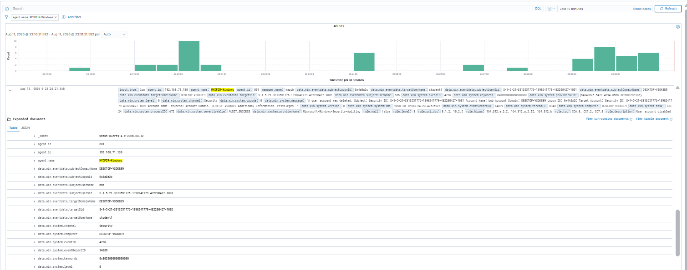

Event ID `4726` corresponded with the deletion of the temporary user account.

I expanded the event and reviewed:

```text
data.win.system.message
```

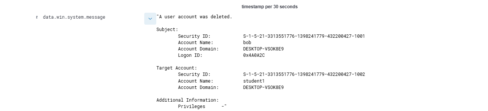

The event provided additional context about the account-management operation, including subject and account information.

This allowed me to correlate the account deletion performed on the endpoint with the resulting Windows security telemetry.

---

## 8. Account Creation — Event ID 4720

I searched for:

```text
data.win.system.eventID: 4720
```

The resulting event corresponded with the creation of the temporary user account.

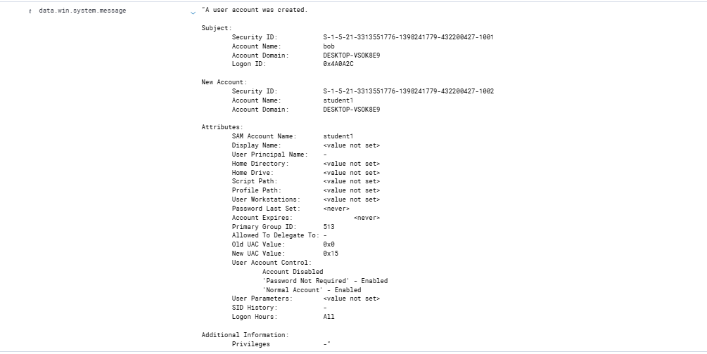

This allowed me to correlate the `Student1` account creation with its corresponding Windows security event.

---

## 9. Successful Logon — Event ID 4624

I then searched for:

```text
data.win.system.eventID: 4624
```

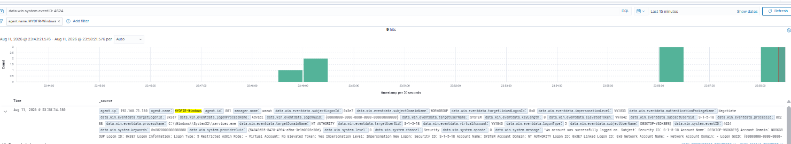

I expanded the event and reviewed:

```text
data.win.system.message
```

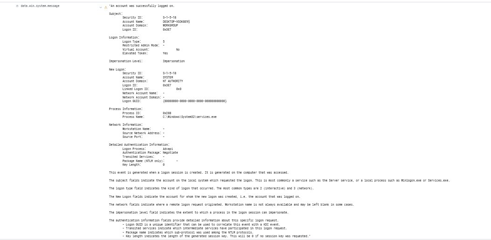

The event contained authentication and logon context that could be used when reviewing successful Windows logon activity.

---

## 10. Local Group Membership — Event ID 4732

I searched for:

```text
data.win.system.eventID: 4732
```

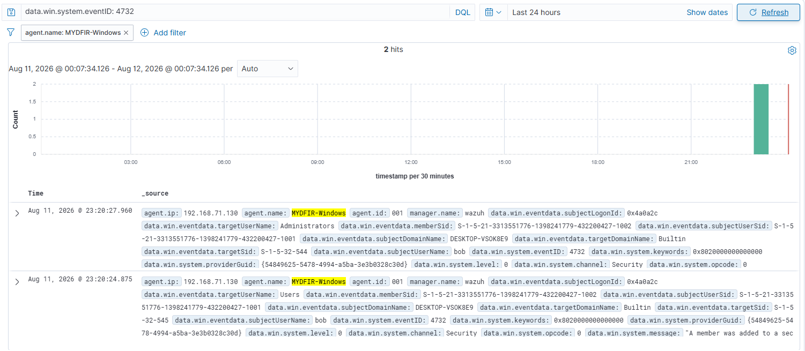

I also reviewed the corresponding event message:

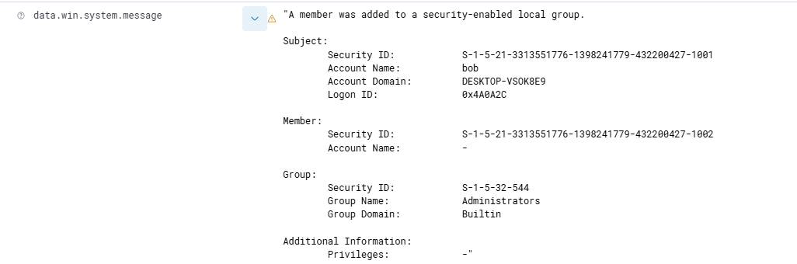

The event corresponded with a member being added to a security-enabled local group.

In this controlled activity, it allowed me to correlate the addition of `Student1` to the local Administrators group with the corresponding security telemetry.

---

# Windows Activity Timeline

The generated account-management activity could now be correlated as a sequence:

```text
Temporary Account Created
        │
        └── Event ID 4720
                ↓
Added to Local Administrators
        │
        └── Event ID 4732
                ↓
Temporary Account Deleted
        │
        └── Event ID 4726
```

Instead of treating each event as an isolated log entry, I could use the related Windows security events to reconstruct the sequence of account-management activity.

---

# Linux SSH Activity Generation

## 11. Generating Failed SSH Authentication

I next generated controlled SSH authentication activity against the Ubuntu endpoint at:

```text
192.168.71.129
```

From the Windows endpoint, I deliberately attempted to authenticate using an invalid username:

```powershell
ssh fakeuser@192.168.71.129
```

I supplied invalid credentials during the test.

After three unsuccessful authentication attempts, access was denied and the SSH connection was closed.

---

## 12. Generating Successful SSH Authentication

I then connected using the valid lab account:

```powershell
ssh myDFIR@192.168.71.129
```

Authentication succeeded and an SSH session was established with the Ubuntu endpoint.

Once connected, I ran:

```bash
ip -s a
```

This generated additional activity within the authenticated SSH session.

---

# Failed SSH Analysis

## 13. Searching for the Invalid User

In Wazuh Discover, I searched for:

```text
fakeuser
```

Multiple related events were returned.

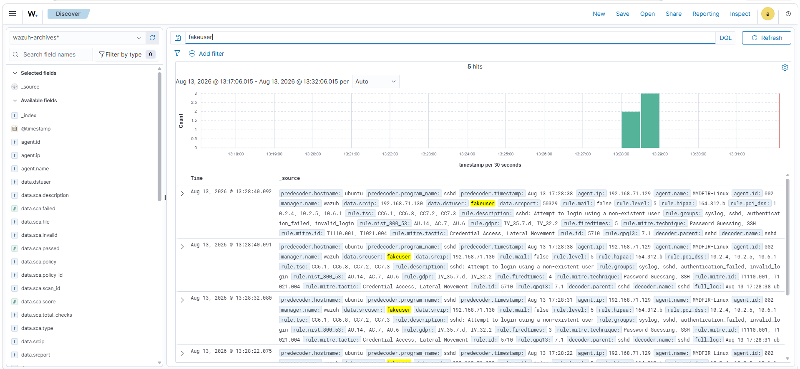

This allowed me to begin reviewing the telemetry associated with the deliberately invalid authentication attempt.

---

## 14. Connection Reset for Invalid User

I expanded one of the resulting events and reviewed:

```text
full_log
```

The log contained information indicating that the connection associated with the invalid SSH user was reset.

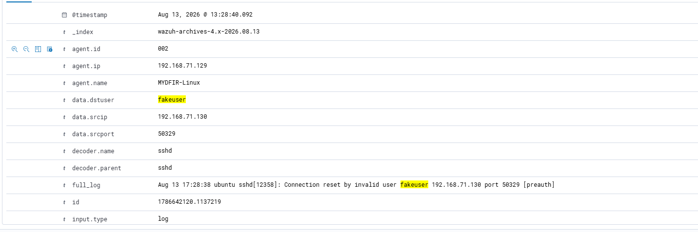

The event also contained source connection information that could be used as an additional correlation point during an investigation.

> **Evidence Note:** Source IP addresses are interpreted directly from the captured Wazuh telemetry rather than inferred from the lab addressing table.

---

## 15. Failed Password Attempt

I reviewed another event associated with `fakeuser`.

The `full_log` field contained:

```text
failed password for invalid user
```

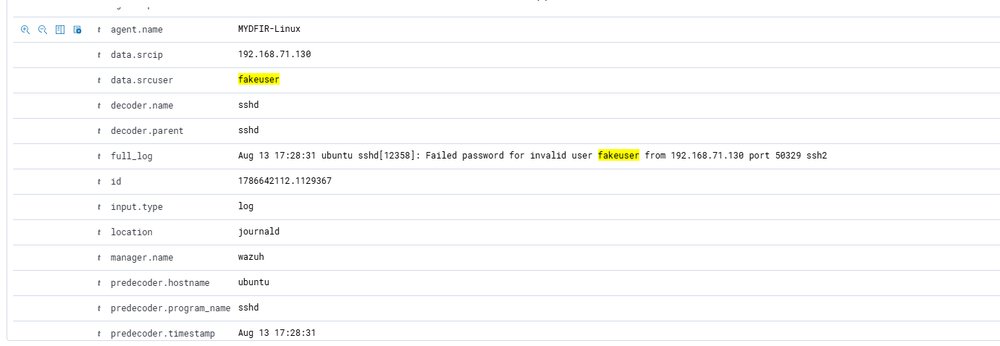

This provided direct evidence of an unsuccessful SSH password authentication attempt involving the invalid account name.

---

# Successful SSH Analysis

## 16. Identifying Successful Authentication

I next searched for the valid lab username together with accepted authentication activity.

The corresponding event was returned:

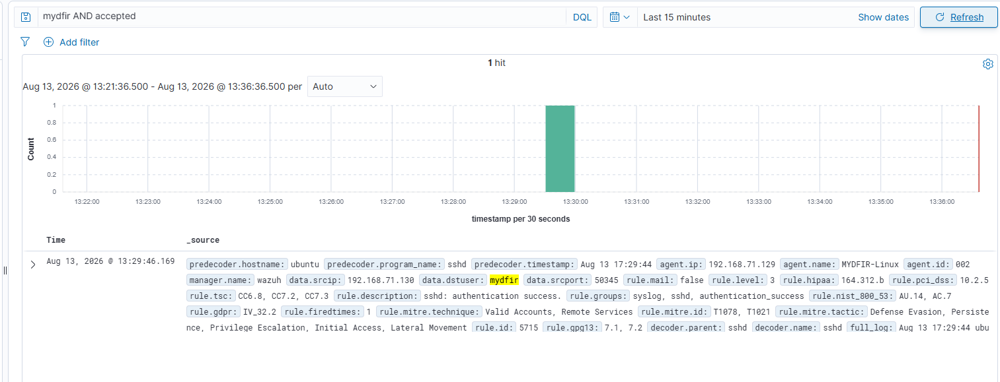

I expanded the event and reviewed:

```text
full_log
```

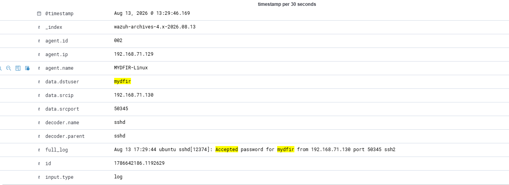

The log contained:

```text
Accepted password
```

associated with the valid account.

This provided evidence that password authentication succeeded for the SSH connection.

---

# SSH Session Correlation

## 17. Tracking the Authenticated Session

A successful authentication event establishes that access occurred, but it does not by itself describe everything that happened during the resulting session.

I therefore reviewed additional telemetry associated with the authenticated user.

For the session examined during this lab, I identified:

```text
Session ID: 19
```

The telemetry also contained an `sshd` process identifier associated with the session.

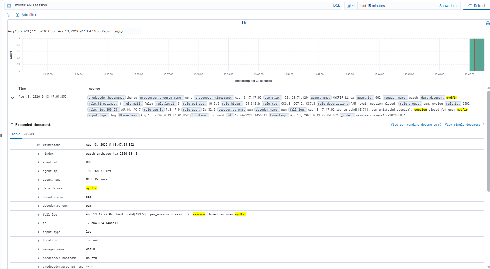

These identifiers provided additional correlation points for following activity associated with the SSH connection.

---

## 18. Reviewing Surrounding Events

I used Wazuh's **View surrounding documents** functionality to review telemetry occurring around the relevant event timestamp.

This allowed me to examine events occurring before and after the selected SSH event rather than treating an individual log entry in isolation.

Useful correlation points included:

```text
Username
Timestamp
Source IP
SSH process
Process identifier
Session information
```

This provided additional context for reconstructing the authenticated session.

---

# Sysmon Session Correlation

## 19. Terminal Session Identifier

I reviewed Sysmon-related Linux telemetry associated with the activity.

Within the event data, I identified a terminal session identifier:

```text
Terminal Session ID: 19
```

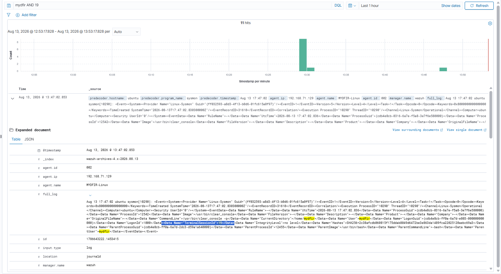

This provided another potential correlation point when reviewing activity generated during the same terminal session.

The important point was not that a single session identifier proves everything that occurred.

Instead, identifiers, timestamps, usernames, processes, and surrounding events can be combined to narrow an investigation and establish relationships between events.

---

# Additional Linux Activity

## 20. Generating and Validating File Activity

I reconnected to the Ubuntu endpoint through SSH:

```powershell
ssh myDFIR@192.168.71.129
```

I first confirmed the active account:

```bash
whoami
```

I then viewed the local account file:

```bash
cat /etc/passwd
```

Next, I redirected the contents of `/etc/passwd` into a new file named `loot.txt` under the `/tmp` directory:

```bash
cat /etc/passwd > /tmp/loot.txt
```

I navigated to the temporary directory:

```bash
cd /tmp
```

and listed its contents:

```bash
ls -la
```

The resulting output confirmed that `loot.txt` had been created successfully.


This generated controlled file-access and file-creation activity that can be examined in the collected endpoint telemetry.

> **Evidence Note:** This step demonstrates local file access and file creation. The data remained on the Ubuntu endpoint; no data exfiltration was performed.

---

# What I Generated

During this stage, I generated controlled activity across both monitored endpoints.

## Windows

```text
Guest account enabled
Guest account password changed
Local account created
Account added to local Administrators group
Local account deleted
Windows logon activity
```

## Linux

```text
Invalid SSH authentication attempts
Successful SSH authentication
SSH session activity
Command execution
Local file access
Local file creation through output redirection
```

---

# What I Investigated

| Activity | Evidence Reviewed |
|---|---|
| Windows account creation | Event ID `4720` |
| Windows account deletion | Event ID `4726` |
| Windows successful logon | Event ID `4624` |
| Local group membership change | Event ID `4732` |
| Invalid SSH username | SSH `full_log` |
| Failed SSH authentication | Failed-password log entry |
| Successful SSH authentication | Accepted-password log entry |
| SSH session | Session and process identifiers |
| Linux terminal activity | Sysmon terminal session identifier |
| Linux file creation | `/tmp/loot.txt` verified on endpoint |

---

# Key Findings

## 1. Individual Events Become More Useful When Correlated

A single Windows event can describe an individual action.

Multiple related events can provide a sequence:

```text
4720 → Account Created
        ↓
4732 → Account Added to Local Group
        ↓
4726 → Account Deleted
```

Viewed together, these events provided more investigative context than any one event in isolation.

---

## 2. Successful and Failed SSH Authentication Produce Different Evidence

The controlled SSH activity produced distinguishable telemetry for:

```text
Invalid User
     ↓
Failed Password
     ↓
Accepted Password
     ↓
Session Activity
```

This means an investigation does not have to stop at determining whether an authentication attempt occurred.

The surrounding telemetry can help establish whether authentication failed, succeeded, and what session-related evidence followed.

---

## 3. Session Identifiers Help Correlate Activity

The SSH and Sysmon telemetry exposed identifiers that could be used to narrow related activity.

Useful correlation fields included:

```text
Username
Source IP
Timestamp
Event ID
Process ID
SSH Session Information
Terminal Session ID
```

No single field should automatically be treated as proof of the complete sequence.

The stronger conclusion comes from correlating multiple pieces of evidence.

---

## 4. Endpoint Evidence Can Validate Generated Activity

The creation of `/tmp/loot.txt` provided endpoint-level confirmation that the controlled file operation occurred.

This is useful when later comparing endpoint activity with centralized telemetry because I know exactly what action was performed and what artifact should exist as a result.

---

# Security Analysis

All activity generated during this stage was intentional and performed inside my controlled lab.

However, similar activity in an enterprise environment could warrant investigation.

For example:

```text
New Local Account
       ↓
Administrative Group Membership
       ↓
Account Deletion
```

could be security-relevant if the activity were unexpected or unauthorized.

Likewise:

```text
Repeated Invalid SSH Authentication
       ↓
Successful Authentication
       ↓
Authenticated Session Activity
```

could become significant depending on the source, account, timing, authentication history, authorization, and actions performed after authentication.

The telemetry alone does not establish malicious intent.

Instead, it provides evidence that an analyst can correlate with environmental context to determine whether activity is expected, suspicious, or potentially malicious.

---

# Evidence vs. Conclusion

| Evidence | What I Can Conclude |
|---|---|
| Event ID `4720` associated with the test account | A local account creation event occurred |
| Event ID `4732` associated with the test account | Local group membership was modified |
| Event ID `4726` associated with the test account | A local account deletion event occurred |
| `failed password for invalid user` | An unsuccessful SSH authentication attempt occurred |
| `Accepted password` | SSH password authentication succeeded |
| SSH session/process identifiers | Related SSH events can be correlated around the connection/session |
| Terminal session identifier | Sysmon provides an additional correlation point for terminal activity |
| `/tmp/loot.txt` present after redirection | The controlled local file creation operation succeeded |

These events alone do not prove malicious intent.

Additional context surrounding the user, source, timing, authorization, and subsequent behavior would be required to make that determination.

---

# Stage Conclusion

This stage moved my Wazuh environment from **collecting telemetry** to **using telemetry for investigation**.

I generated known activity on Windows and Linux, located the resulting events in Wazuh, reviewed relevant fields, and correlated multiple events to reconstruct portions of the activity.

My investigation workflow progressed from:

```text
Generate Activity
       ↓
Locate Telemetry
       ↓
Identify Relevant Fields
       ↓
Correlate Related Events
       ↓
Reconstruct Activity
       ↓
Evaluate Security Context
```

The environment is now ready for the next stage: transforming the collected telemetry into a SOC-focused dashboard for faster monitoring and analysis.

---

## Next Stage

The next stage will focus on building a SOC dashboard from the telemetry generated across the Windows and Linux endpoints.
