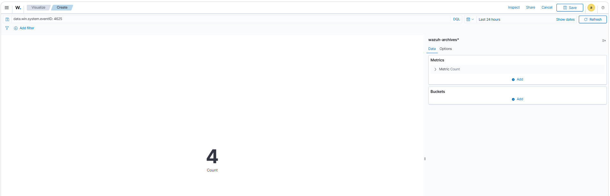
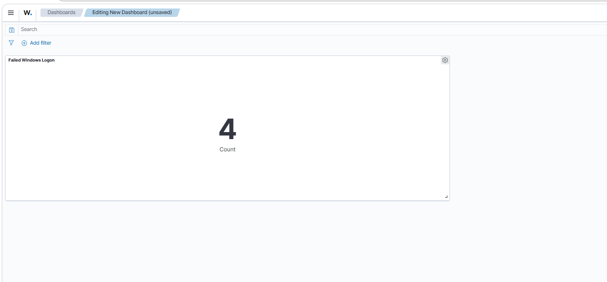
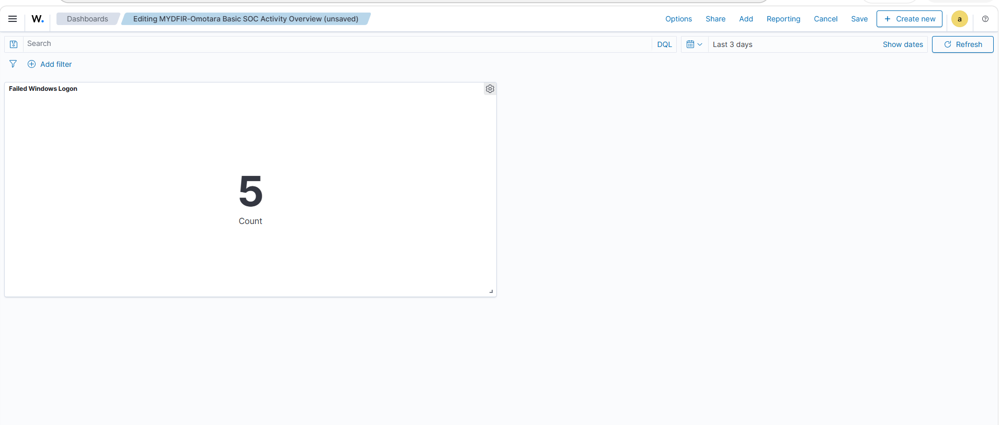
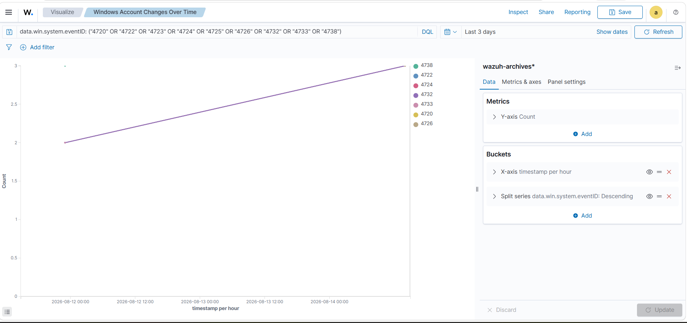
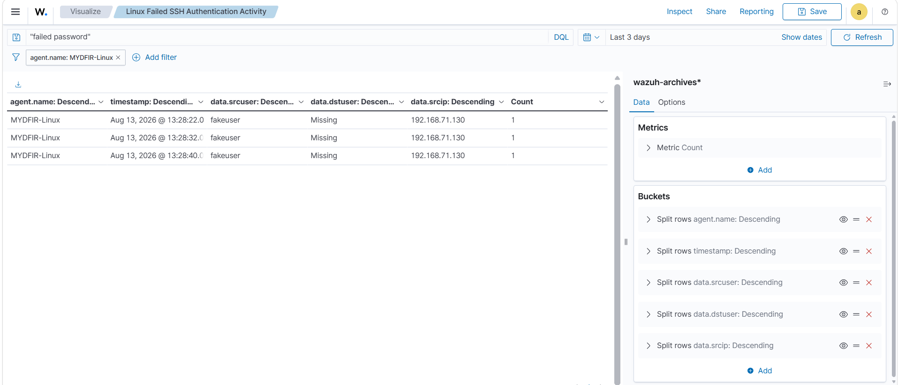
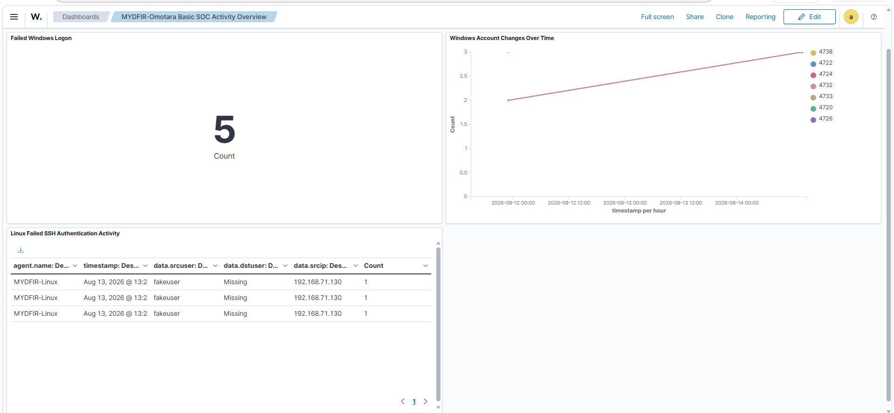

# SOC Activity Dashboard

## Overview

In this stage, I transformed telemetry collected from my Windows and Linux endpoints into a three-panel security monitoring dashboard in Wazuh.

Rather than repeatedly searching raw events in Discover, I created reusable visualizations for security activity I had already generated and investigated during the previous stage.

The dashboard provides visibility into:

- Failed Windows logons
- Windows account changes over time
- Failed SSH authentication activity on the Linux endpoint

The objective was to move from individual event investigation toward a reusable monitoring view that can surface authentication and account-management activity for further analysis.

---

## Lab Systems

| System | Role | IP Address |
|---|---|---|
| Wazuh Server | Centralized security monitoring | `192.168.71.128` |
| Ubuntu Endpoint | Linux monitored endpoint | `192.168.71.129` |
| Windows Endpoint | Windows monitored endpoint | `192.168.71.130` |

---

## Dashboard Design

I created three visualization panels:

| Panel | Visualization | Monitoring Purpose |
|---|---|---|
| Failed Windows Logon | Metric | Surface failed Windows authentication activity |
| Windows Account Changes Over Time | Line Chart | Track Windows account-management events over time |
| Linux Failed SSH Authentication Activity | Data Table | Display contextual information for failed Linux SSH authentication |

All three panels use telemetry from the Wazuh archives data source.

---

# Panel 1 — Failed Windows Logon

## 1. Identifying the Relevant Event

The first panel was designed to monitor failed Windows logon activity.

Windows failed logon activity in this lab was identified using:

```text
Event ID: 4625
```

I initially performed a broad search for:

```text
4625
```

This returned matching telemetry, but searching only for the number was not sufficiently precise because the same value could potentially appear elsewhere within an event.

I therefore returned to Discover and targeted the Windows event ID field directly:

```text
data.win.system.eventID:4625
```



This allowed me to target events where `4625` specifically represented the Windows Event ID rather than relying on a generic text search.

---

## 2. Generating Additional Failed Logon Telemetry

The initial search contained limited failed-logon telemetry.

To create enough controlled activity to validate the visualization, I generated additional failed Windows authentication attempts within my lab environment.

I then returned to Wazuh and refreshed the search.

The additional activity produced more Event ID `4625` telemetry that could be used to test the panel.

> **Lab Note:** These failed authentication attempts were intentionally generated inside my isolated lab for telemetry and dashboard validation.

---

## 3. Creating the Metric Panel

From the Wazuh dashboard editor, I created a new **Metric** visualization.

I selected the Wazuh archives data source and applied the validated failed-logon query:

```text
data.win.system.eventID:4625
```

The visualization calculates the number of matching events within the selected dashboard time range and presents the result as a single value.

I named the panel:

```text
Failed Windows Logon
```



The metric provides a quick view of failed Windows authentication activity during the selected time period.

---

# Building the Main Dashboard

## 4. Creating the Main Dashboard

After creating the first visualization, I created the main dashboard and added the failed Windows logon metric.

I named the dashboard:

```text
MyDFIR - Omotara Basic SOC Activity Overview
```



At this point, the dashboard contained one working monitoring panel.

I then expanded the dashboard with additional Windows account-management and Linux SSH authentication visualizations.

---

# Panel 2 — Windows Account Changes Over Time

## 5. Selecting Windows Account-Management Events

The second panel was designed to visualize Windows account-management activity over time.

During the previous telemetry-analysis stage, I generated and investigated account-management activity on the Windows endpoint.

For this dashboard, I monitored several Windows security event IDs associated with account and local group changes:

```text
4720
4722
4723
4725
4726
4732
4733
4738
```

These event IDs allow multiple types of account-management activity to be represented within the same visualization.

The Windows event field used throughout the query and visualization was:

```text
data.win.system.eventID
```

---

## 6. Creating the Line Chart

I created a new **Line** visualization using the Wazuh archives data source.

For the metric, I configured:

```text
Y-axis:
Count
```

For the time dimension, I configured:

```text
X-axis:
Date Histogram

Field:
@timestamp
```

I then split the series using:

```text
data.win.system.eventID
```

This allowed different Windows account-management event IDs to be represented separately across the selected time range.

I named the visualization:

```text
Windows Account Changes Over Time
```



The resulting visualization provides a time-based view of the Windows account-management activity represented by the selected event IDs.

Rather than reviewing each event individually, I can use the line chart to identify when account-related activity occurred and then investigate the underlying events when necessary.

---

# Panel 3 — Linux Failed SSH Authentication Activity

## 7. Isolating the Linux Endpoint

The third panel focused on failed SSH authentication activity against my Ubuntu endpoint.

I created a new visualization and filtered the data to the Linux Wazuh agent:

```text
MYDFIR-Linux
```

This restricted the visualization to telemetry associated with the monitored Ubuntu endpoint.

---

## 8. Filtering Failed SSH Authentication

During the previous stage, I deliberately generated failed SSH authentication attempts against:

```text
192.168.71.129
```

using an invalid account.

The resulting telemetry contained messages associated with failed password authentication.

For the dashboard, I searched for:

```text
"failed password"
```

This isolated the failed SSH password activity I wanted to display.

---

## 9. Creating the Data Table

For this panel, I selected a **Data Table** visualization.

Unlike the Windows failed-logon metric, I wanted this visualization to retain event-level context that could be useful when reviewing authentication activity.

I configured rows representing:

```text
Timestamp
Agent Name
Source User
Destination User
Source IP
```

I named the panel:

```text
Linux Failed SSH Authentication Activity
```



The resulting table provides more than an event count.

It exposes contextual fields that can help answer questions such as:

- When did the authentication attempt occur?
- Which monitored endpoint generated the event?
- Which user information was recorded?
- What source information was available?

This makes the table useful as a starting point for deeper investigation.

---

# Completed SOC Activity Dashboard

## 10. Combining the Three Panels

After creating each visualization, I added all three panels to:

```text
MyDFIR - Omotara Basic SOC Activity Overview
```

The completed dashboard contained:

```text
┌──────────────────────────────────────────┐
│          Failed Windows Logon            │
│                 Metric                   │
├──────────────────────────────────────────┤
│                                          │
│    Windows Account Changes Over Time     │
│               Line Chart                 │
│                                          │
├──────────────────────────────────────────┤
│                                          │
│ Linux Failed SSH Authentication Activity │
│               Data Table                 │
│                                          │
└──────────────────────────────────────────┘
```



The completed dashboard provides a centralized monitoring view across both Windows and Linux endpoint activity.

---

# Why I Used Three Different Visualizations

I used different visualization types because each panel answers a different monitoring question.

## Metric — Failed Windows Logon

The metric answers:

> **How many failed Windows logon events occurred during the selected time range?**

It provides a quick high-level indicator of Event ID `4625` activity.

---

## Line Chart — Windows Account Changes

The line chart answers:

> **When did the selected Windows account-management events occur?**

Using `@timestamp` together with:

```text
data.win.system.eventID
```

allows the selected account-management events to be viewed across time.

This makes periods or clusters of account activity easier to identify.

---

## Data Table — Linux Failed SSH Authentication

The data table answers:

> **What contextual information is available about the individual failed SSH authentication events?**

Instead of reducing the activity to a single number, the table preserves fields that can support further investigation.

---

# From Raw Telemetry to Monitoring

During the previous stage, my primary workflow was:

```text
Generate Activity
       ↓
Search Discover
       ↓
Locate Event
       ↓
Expand Event
       ↓
Analyze Fields
       ↓
Correlate Activity
```

After building the dashboard, I can use a monitoring workflow:

```text
Endpoint Activity
       ↓
Telemetry Collection
       ↓
Wazuh Archives
       ↓
Queries & Filters
       ↓
Dashboard Visualizations
       ↓
Identify Activity
       ↓
Investigate Underlying Events
```

The dashboard does not replace event-level investigation.

Instead, it provides a reusable way to surface activity that may require deeper analysis in Discover.

---

# Key Findings

## 1. Precise Queries Matter

One of the most important lessons from building the first panel was the difference between searching for:

```text
4625
```

and querying the actual Windows event field:

```text
data.win.system.eventID:4625
```

The second approach is more precise because it targets the field representing the Windows Event ID.

This reinforced the importance of understanding the telemetry schema rather than relying only on free-text searches.

---

## 2. Visualization Should Match the Monitoring Question

Different security questions require different visualization approaches.

I used:

```text
Metric
   ↓
High-level event count

Line Chart
   ↓
Activity over time

Data Table
   ↓
Event-level context
```

The objective was not simply to create three different chart types.

Each visualization was selected based on the type of security question I wanted the panel to answer.

---

## 3. Dashboards Support Triage, Not Final Conclusions

A failed authentication count or a spike in account-management events does not automatically indicate malicious activity.

The dashboard can surface activity that deserves attention, but determining whether the activity is expected, suspicious, or malicious still requires investigation and environmental context.

For example:

```text
Failed Authentication Spike
          ↓
Identify Time Window
          ↓
Review Source/User Context
          ↓
Examine Underlying Events
          ↓
Correlate Related Activity
          ↓
Determine Significance
```

The visualization is the starting point, not the final security conclusion.

---

## 4. Previously Generated Telemetry Became Reusable

The telemetry generated during the previous stage was not only useful for one-time investigation.

I reused those event sources to create monitoring views that can continue to display matching activity as new telemetry is collected.

This moved the lab from individual event analysis toward repeatable security monitoring.

---

# What I Built

By the end of this stage, I had created a three-panel Wazuh security monitoring dashboard.

### Failed Windows Logon

```text
Event ID: 4625
Field: data.win.system.eventID
Visualization: Metric
Purpose: High-level failed Windows authentication count
```

### Windows Account Changes Over Time

```text
Event IDs:
4720
4722
4723
4725
4726
4732
4733
4738

Event Field:
data.win.system.eventID

Visualization:
Line Chart

Purpose:
Account-management activity over time
```

### Linux Failed SSH Authentication Activity

```text
Endpoint:
MYDFIR-Linux

Activity:
Failed SSH password authentication

Visualization:
Data Table

Purpose:
Event-level authentication context
```

All three panels were combined into:

```text
MyDFIR - Omotara Basic SOC Activity Overview
```

---

# Skills Demonstrated

This stage provided hands-on experience with:

- Wazuh dashboard creation
- Security event visualization
- Windows Event ID analysis
- Structured field querying
- Authentication monitoring
- Account-management monitoring
- Linux SSH telemetry analysis
- Time-series security analysis
- Dashboard filtering
- Event aggregation
- Security monitoring workflow design
- Translating raw telemetry into reusable monitoring views

---

# Stage Conclusion

In this stage, I transformed previously generated Windows and Linux telemetry into a reusable security monitoring dashboard.

I built three panels using metric, time-series, and tabular visualizations to provide different levels of security visibility.

The project has now progressed through:

```text
Infrastructure Deployment
        ↓
Endpoint Integration
        ↓
Telemetry Collection
        ↓
Telemetry Generation
        ↓
Event Analysis
        ↓
Event Correlation
        ↓
Dashboard Monitoring
```

The dashboard gives me a faster way to surface relevant authentication and account-management activity while retaining the ability to investigate the underlying telemetry in Wazuh Discover.

The next stage will move beyond visualization into monitoring file-system changes and developing custom detection logic.

---

## Next Stage

The next stage will focus on:

- Configuring File Integrity Monitoring (FIM)
- Generating controlled file changes
- Validating FIM telemetry
- Creating my first custom detection
- Testing whether the detection triggers as expected
