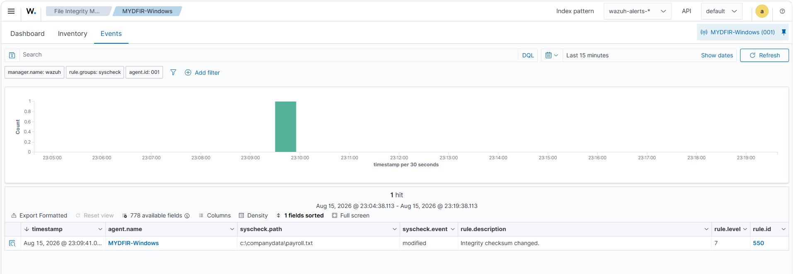
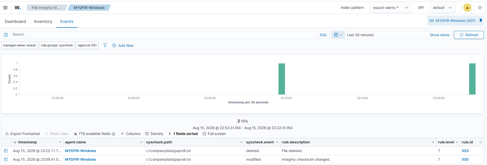
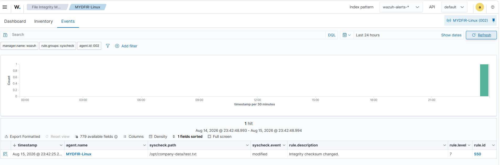
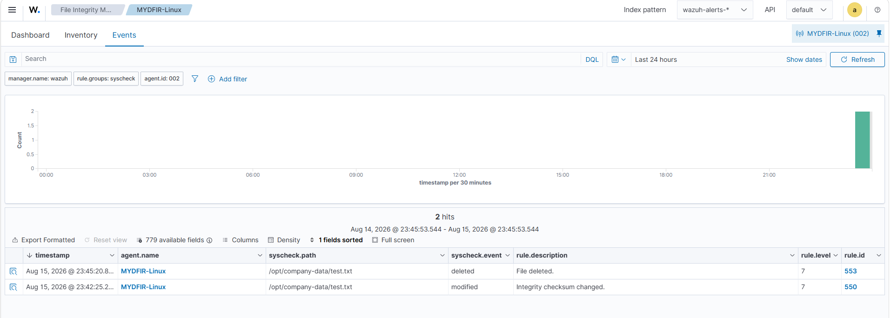
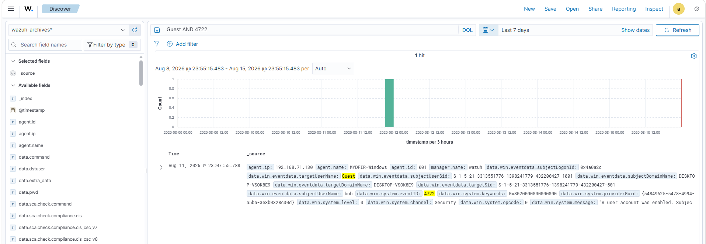
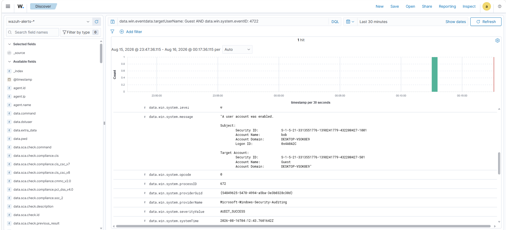
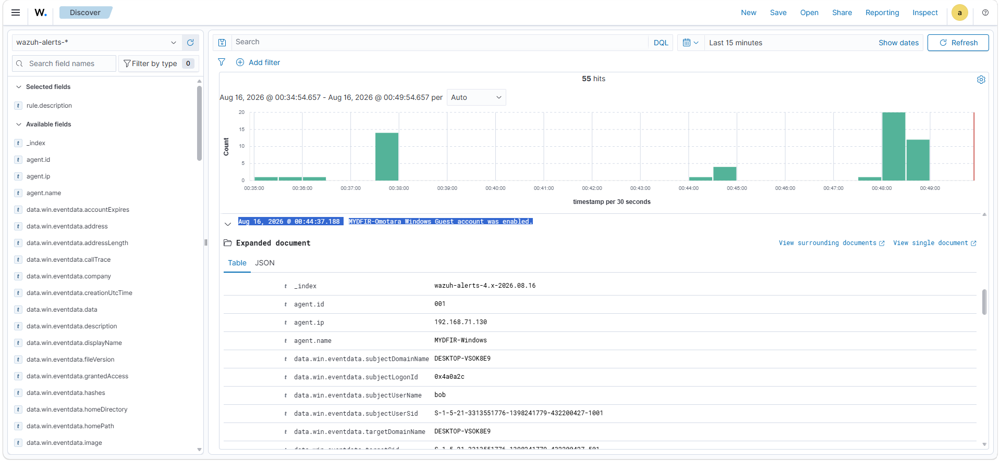

# File Integrity Monitoring & Custom Detection Engineering

## Overview

In this stage, I extended my Wazuh lab beyond telemetry collection and dashboard visualization by implementing two additional security monitoring capabilities:

1. Real-time File Integrity Monitoring (FIM) across Windows and Linux endpoints.
2. A custom Wazuh detection rule for Windows Guest account enablement.

For FIM, I configured Wazuh to monitor custom directories and validated detection by modifying and deleting files on both endpoints.

For the custom detection, I identified the Windows telemetry associated with enabling the built-in Guest account, translated the observed event fields into Wazuh rule logic, and generated controlled activity to validate the detection.

The objective was to progress from reviewing existing telemetry to configuring what Wazuh should monitor and defining custom detection logic for security-relevant activity.

---

# Part 1 — File Integrity Monitoring

## What is File Integrity Monitoring?

Wazuh File Integrity Monitoring tracks changes to monitored files and directories.

In this lab, I configured real-time monitoring so that changes within selected directories could be detected without waiting for the normal scheduled FIM scan.

I tested three types of file-system activity:

```text
File creation
File modification
File deletion
```

I configured FIM independently on my Windows and Ubuntu endpoints.

---

# Windows File Integrity Monitoring

## 1. Creating the Monitored Directory

I connected to the Windows endpoint through RDP and created:

```text
C:\CompanyData
```

Inside the directory, I created:

```text
Payroll.txt
```

and added test content to the file.

This provided a controlled directory and file that I could use to validate Wazuh FIM.

---

## 2. Reviewing the Wazuh FIM Configuration

I opened the Windows Wazuh agent configuration file with administrative privileges.

The FIM configuration is located within the:

```xml
<syscheck>
```

section of `ossec.conf`.

The configuration showed that FIM was enabled:

```xml
<disabled>no</disabled>
```

and contained the scheduled scan frequency:

```xml
<frequency>43200</frequency>
```

I also reviewed existing real-time directory monitoring entries before adding my custom directory.

---

## 3. Adding Real-Time Monitoring

I added the following configuration:

```xml
<directories realtime="yes">C:\CompanyData</directories>
```

This instructed the Wazuh agent to monitor the `CompanyData` directory in real time.

After saving the configuration, I restarted the Wazuh agent service so the configuration change would take effect.

---

## 4. Testing File Modification Detection

To generate a controlled file modification, I opened:

```text
C:\CompanyData\Payroll.txt
```

and added:

```text
123
```

I saved the file and returned to the Wazuh dashboard.

Under the Windows agent's File Integrity Monitoring events, Wazuh generated an event referencing:

```text
C:\CompanyData\Payroll.txt
```

The event indicated that the integrity checksum had changed.



This confirmed that the real-time FIM configuration detected modification of the monitored file.

---

## 5. Testing File Deletion Detection

I then deleted:

```text
C:\CompanyData\Payroll.txt
```

After returning to Wazuh, an additional FIM event was generated indicating that the monitored file had been deleted.



This validated that the Windows FIM configuration could detect both file modification and file deletion within the monitored directory.

---

# Linux File Integrity Monitoring

## 6. Creating the Monitored Directory

I connected to the Ubuntu endpoint through SSH and elevated to the root account.

I created a dedicated directory:

```bash
mkdir /opt/company-data
```

I then created a test file inside the directory:

```bash
echo "Payroll Data" > /opt/company-data/test.txt
```

This created:

```text
/opt/company-data/test.txt
```

which I used to validate Linux FIM.

---

## 7. Configuring Linux FIM

I opened the Wazuh agent configuration:

```bash
nano /var/ossec/etc/ossec.conf
```

Within the FIM configuration, I added:

```xml
<directories realtime="yes">/opt/company-data</directories>
```

After saving the configuration, I restarted the Linux Wazuh agent:

```bash
systemctl restart wazuh-agent.service
```

This applied the updated FIM configuration.

---

## 8. Testing Linux File Modification

I modified the monitored file:

```bash
nano /opt/company-data/test.txt
```

I added:

```text
123
```

and saved the change.

I then returned to the Wazuh dashboard and reviewed the Linux agent's File Integrity Monitoring events.

Wazuh generated an event for:

```text
/opt/company-data/test.txt
```

indicating that the file's integrity checksum had changed.



This confirmed that Wazuh was monitoring the custom Linux directory in real time.

---

## 9. Testing Linux File Deletion

I deleted the monitored file:

```bash
rm /opt/company-data/test.txt
```

Wazuh subsequently generated another FIM event indicating that the file had been deleted.



The Windows and Linux tests demonstrated the same basic monitoring workflow:

```text
Configure Directory
        ↓
Restart Wazuh Agent
        ↓
Modify Monitored File
        ↓
Wazuh Detects Change
        ↓
Delete Monitored File
        ↓
Wazuh Detects Deletion
```

---

# FIM Validation Results

| Endpoint | Monitored Directory | Test | Result |
|---|---|---|---|
| Windows | `C:\CompanyData` | Modify file | Detected |
| Windows | `C:\CompanyData` | Delete file | Detected |
| Linux | `/opt/company-data` | Modify file | Detected |
| Linux | `/opt/company-data` | Delete file | Detected |

The tests confirmed that my Wazuh agents were monitoring the custom directories and reporting file-system changes to the Wazuh platform.

---

# Part 2 — Custom Detection Engineering

## 10. Detection Objective

After validating FIM, I created my first custom Wazuh detection rule.

The behavior I wanted to detect was:

> **The built-in Windows Guest account being enabled.**

Earlier in the lab, I had generated this activity while investigating Windows account-management telemetry.

Before testing the custom detection, I returned to Computer Management on the Windows endpoint and disabled the Guest account so that I could reproduce the enablement event in a controlled manner.

---

# Identifying the Detection Telemetry

## 11. Investigating the Guest Account Event

Before writing the rule, I returned to Wazuh Discover and searched the existing telemetry for:

```text
Guest
```

I reviewed the resulting Windows events and identified:

```text
Event ID: 4722
```

as the event associated with the account being enabled.

I then examined the event fields required to distinguish Guest account enablement from other account enablement events.

The two relevant fields were:

```text
data.win.system.eventID
data.win.eventdata.targetUserName
```

I combined them into the following Discover query:

```text
data.win.eventdata.targetUserName: Guest AND data.win.system.eventID: 4722
```



This query gave me the two conditions needed for the detection:

```text
Event ID == 4722
        AND
Target User == Guest
```

---

# Translating the Query into Detection Logic

## 12. From Search to Rule

The Discover query was useful for finding existing events:

```text
data.win.eventdata.targetUserName: Guest AND data.win.system.eventID: 4722
```

However, my objective was to turn that search logic into a reusable Wazuh detection.

The logical condition became:

```text
Windows Security Event
        ↓
Event ID = 4722?
        │
        ├── No → Rule does not match
        │
        └── Yes
                ↓
Target User = Guest?
        │
        ├── No → Rule does not match
        │
        └── Yes
                ↓
Custom Detection
```

---

# Custom Wazuh Rule

## 13. Creating the Rule

I navigated to:

```text
Server Management
→ Rules
→ Custom Rules
→ local_rules.xml
```

I added the following custom rule:

```xml
<group name="windows,windows_security,account_changed,adduser">

  <rule id="100200" level="12">
    <if_sid>60103</if_sid>
    <field name="win.system.eventID">^4722$</field>
    <field name="win.eventdata.targetUserName">^Guest$</field>

    <description>MYDFIR-Omotara Windows Guest account was enabled.</description>

    <mitre>
      <id>T1078</id>
    </mitre>

    <group>
      windows,
      windows_account_management,
      account_enabled,
      guest_account,
    </group>
  </rule>

</group>
```

The custom rule uses:

```text
Rule ID: 100200
Level: 12
```

and requires both the Windows event ID and target username conditions to match.

---

# Understanding the Rule

## Rule ID

```xml
id="100200"
```

I assigned `100200` as the identifier for this custom detection.

---

## Rule Level

```xml
level="12"
```

I configured the custom rule at level `12` so that a matching event would be treated as a high-priority alert within this lab.

The severity represents how I chose to prioritize this behavior for the controlled environment; it does not mean every Guest-account enablement event is malicious.

---

## Parent Rule

```xml
<if_sid>60103</if_sid>
```

The rule uses `if_sid` to require the specified Wazuh rule to have matched before the additional custom conditions are evaluated.

---

## Event ID Condition

```xml
<field name="win.system.eventID">^4722$</field>
```

This requires the decoded Windows event ID to match:

```text
4722
```

which corresponds to a user account being enabled.

The anchors:

```text
^
$
```

ensure the field matches the specified value rather than a partial value.

---

## Target Account Condition

```xml
<field name="win.eventdata.targetUserName">^Guest$</field>
```

This narrows the detection from any account-enable event to the account named:

```text
Guest
```

Both field conditions must therefore be satisfied.

---

## Rule Description

```xml
<description>MYDFIR-Omotara Windows Guest account was enabled.</description>
```

The description makes the alert immediately understandable when it appears in Wazuh.

---

# Detection Validation

## 14. Generating the Test Event

With the Guest account disabled and the custom rule configured, I returned to the Windows endpoint.

Using Computer Management, I enabled the Guest account.

This intentionally generated the Windows account-management activity required by the rule:

```text
Target Account: Guest
Event ID: 4722
```

I repeated the controlled enable/disable process as needed to validate the behavior.

---

## 15. Validating the Custom Detection

I returned to Wazuh and searched the Windows endpoint telemetry.

The Guest account enablement event appeared in the collected Windows security data.



I expanded the resulting event to review its details.



The test demonstrated the detection workflow:

```text
Guest Account Disabled
        ↓
Custom Rule Configured
        ↓
Guest Account Enabled
        ↓
Windows Generates Event 4722
        ↓
Wazuh Processes the Event
        ↓
Target User = Guest
        ↓
Custom Rule Conditions Match
        ↓
Custom Alert Generated
```

---

# Search vs. Detection

This stage also demonstrated an important distinction between searching existing telemetry and creating detection logic.

## Search

```text
data.win.eventdata.targetUserName: Guest AND data.win.system.eventID: 4722
```

The query allows me to locate matching events that already exist in Wazuh.

## Detection Rule

```xml
<field name="win.system.eventID">^4722$</field>
<field name="win.eventdata.targetUserName">^Guest$</field>
```

The custom rule defines conditions Wazuh can evaluate against processed events and generate a dedicated alert when those conditions are satisfied.

The workflow therefore progressed from:

```text
Observe Behavior
      ↓
Identify Relevant Telemetry
      ↓
Determine Relevant Fields
      ↓
Build Search Query
      ↓
Translate Conditions into Rule Logic
      ↓
Generate Controlled Activity
      ↓
Validate Detection
```

---

# Detection Analysis

The rule detects a specific administrative action:

```text
Windows Guest account enabled
```

It does **not** establish that the action is malicious.

In a real environment, an analyst would need additional context such as:

```text
Who enabled the account?
Was the action authorized?
When did it occur?
What endpoint was affected?
Was the Guest account subsequently used?
Were there successful logons?
What activity followed the enablement?
Were other account-management changes made?
```

This distinction is important because detection logic identifies activity requiring attention; investigation determines its security significance.

---

# MITRE ATT&CK Mapping Note

The implemented lab rule contains:

```xml
<mitre>
  <id>T1078</id>
</mitre>
```

representing **Valid Accounts**.

I retained this mapping because it is part of the rule implemented and tested during this stage.

However, enabling the Guest account by itself does not prove that Valid Accounts was used by an adversary.

The event establishes that the account was enabled. Additional evidence, such as subsequent authentication or use of the account, would be required before making a stronger behavioral conclusion.

---

# What I Built

By the end of this stage, I had implemented:

### Windows FIM

```text
Monitored Path:
C:\CompanyData

Configuration:
<directories realtime="yes">C:\CompanyData</directories>

Validated:
File modification
File deletion
```

### Linux FIM

```text
Monitored Path:
/opt/company-data

Configuration:
<directories realtime="yes">/opt/company-data</directories>

Validated:
File modification
File deletion
```

### Custom Windows Detection

```text
Detection:
Windows Guest account enabled

Event ID:
4722

Target User:
Guest

Discover Query:
data.win.eventdata.targetUserName: Guest AND data.win.system.eventID: 4722

Custom Rule:
100200

Alert Level:
12
```

---

# Key Findings

## 1. Monitoring Requires Explicit Scope

Installing an endpoint agent does not automatically mean every custom directory is being monitored for file changes.

I explicitly added:

```text
C:\CompanyData
```

and:

```text
/opt/company-data
```

to the respective FIM configurations.

This reinforced the importance of understanding what telemetry and monitoring coverage are actually configured rather than assuming visibility exists.

---

## 2. Detection Engineering Starts with Understanding the Event

I did not begin the Guest-account detection by immediately writing XML.

I first generated and investigated the activity, identified Event ID `4722`, located the target username field, and created a query that isolated the behavior.

Only then did I translate those conditions into a custom rule.

---

## 3. A Query and a Detection Rule Serve Different Purposes

The Discover query helped me find the behavior:

```text
data.win.eventdata.targetUserName: Guest AND data.win.system.eventID: 4722
```

The custom Wazuh rule turned those conditions into reusable detection logic.

---

## 4. Detection Does Not Equal Malicious

The custom rule proves that the configured conditions matched.

It does not prove malicious intent.

That determination requires additional context and investigation.

---

# Skills Demonstrated

This stage provided hands-on experience with:

- File Integrity Monitoring
- Windows file-system monitoring
- Linux file-system monitoring
- Real-time FIM configuration
- Wazuh agent configuration
- Security telemetry validation
- Windows Event ID analysis
- Structured event-field analysis
- Custom Wazuh rules
- XML detection logic
- Detection engineering
- Detection validation
- Alert prioritization
- Evidence-based security analysis

---

# Stage Conclusion

This stage moved the lab beyond collecting, searching, and visualizing telemetry.

I configured Wazuh to monitor specific file-system locations across Windows and Linux and validated that modifications and deletions produced FIM events.

I then used previously observed Windows account-management telemetry to create a custom detection for Guest-account enablement.

The overall project has now progressed through:

```text
Infrastructure Deployment
        ↓
Endpoint Integration
        ↓
Telemetry Collection
        ↓
Telemetry Generation
        ↓
Event Investigation
        ↓
Event Correlation
        ↓
Dashboard Monitoring
        ↓
File Integrity Monitoring
        ↓
Custom Detection Engineering
        ↓
Detection Validation
```

The next stage will build on this detection capability by configuring automated response behavior and validating how Wazuh can take action when defined security conditions are met.

---

## References

- Wazuh Rules Syntax — used as a reference for the XML rule structure, rule conditions, field matching, rule levels, `if_sid`, groups, descriptions, and MITRE ATT&CK mapping.
- Wazuh File Integrity Monitoring documentation — used as a reference for real-time directory monitoring and agent FIM configuration.
