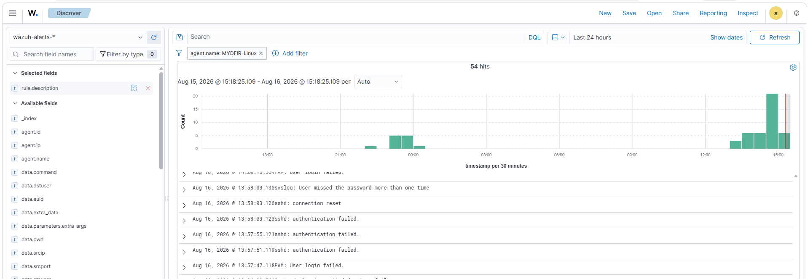
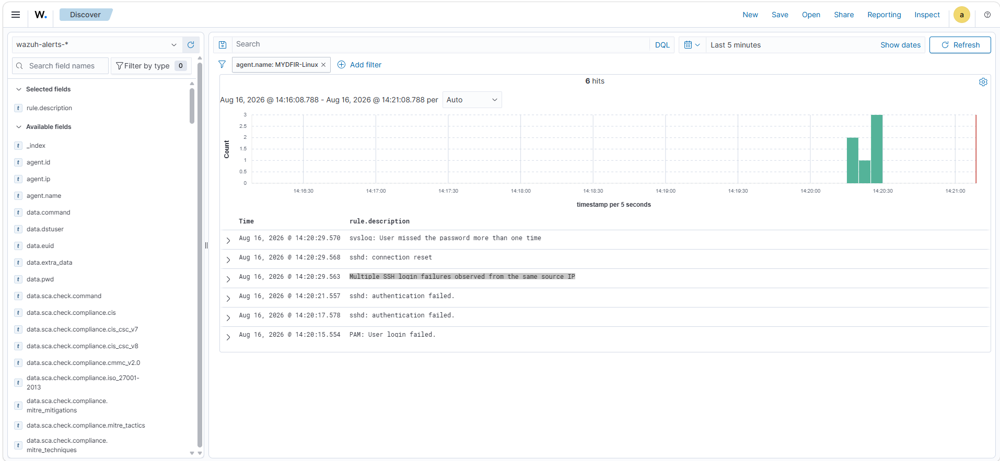
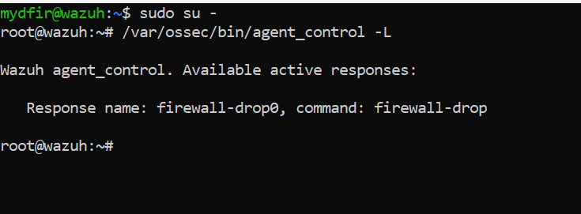
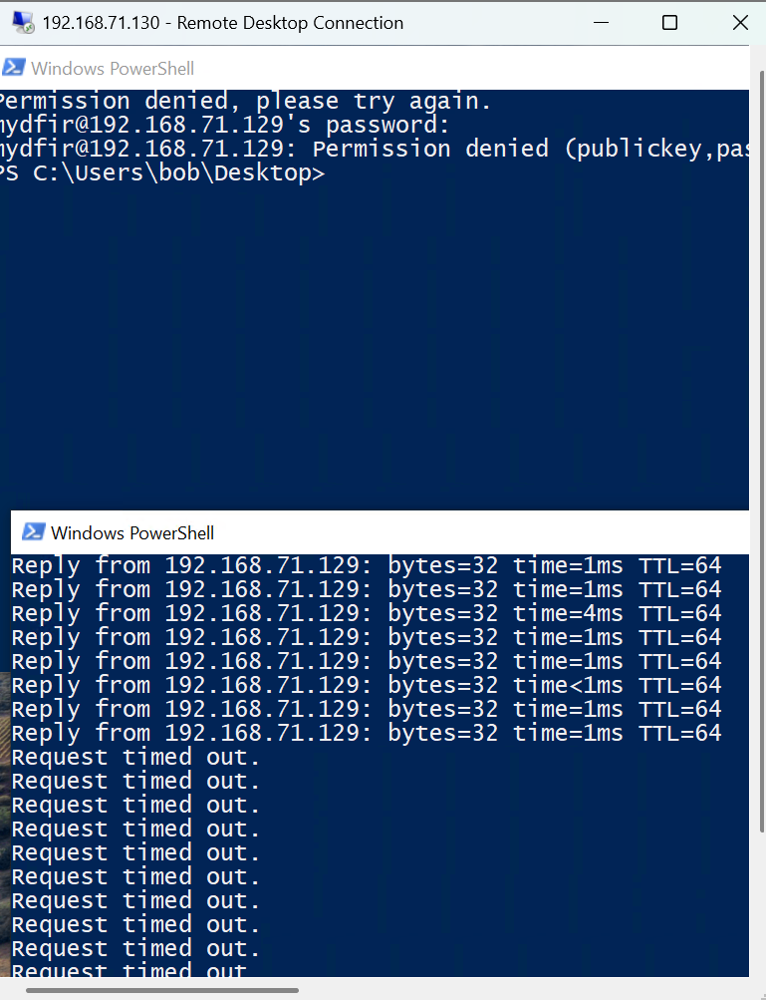
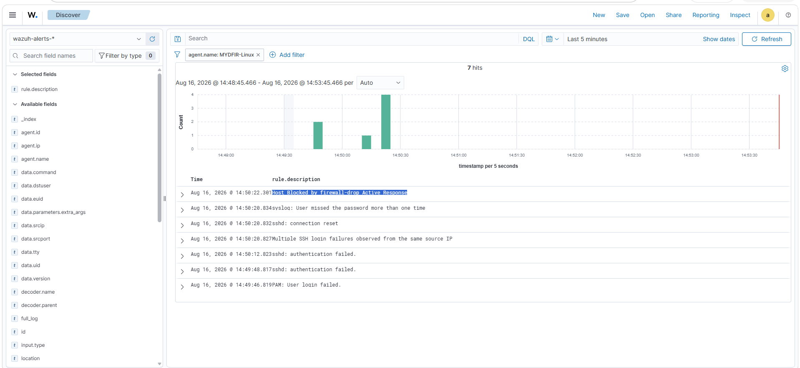
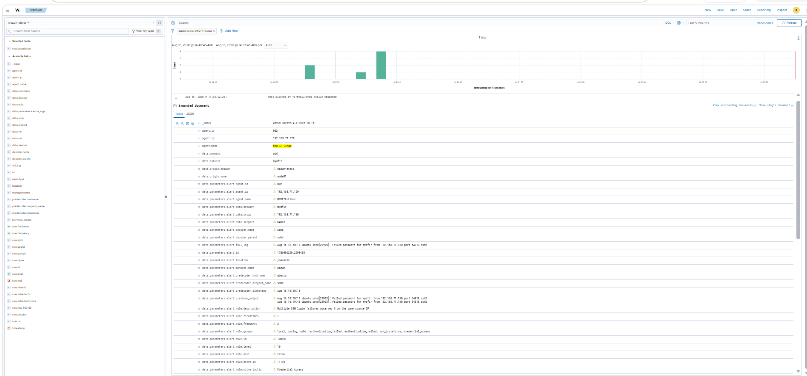

# Automated Response to Repeated SSH Authentication Failures

## Overview

In this stage, I extended my Wazuh lab from detection into automated response.

I first created a custom correlation rule to detect repeated SSH authentication failures from the same source IP address. After validating that the rule triggered as expected, I connected the detection to Wazuh Active Response using the `firewall-drop` command.

I then generated controlled failed SSH authentication attempts from my Windows endpoint against the Ubuntu endpoint and validated that Wazuh automatically blocked the source.

Finally, I inspected the resulting firewall rules and manually restored connectivity after completing the test.

The objective was to build and validate the following workflow:

```text
Repeated SSH Authentication Failures
              ↓
      Wazuh Telemetry
              ↓
      Correlation Rule
              ↓
       Rule 100101
              ↓
       Active Response
              ↓
        firewall-drop
              ↓
       Source IP Blocked
              ↓
      Response Validated
              ↓
      Connectivity Restored
```

---

# Lab Systems

| System | Role | IP Address |
|---|---|---|
| Wazuh Server | Security monitoring and response management | `192.168.71.128` |
| Ubuntu Endpoint | SSH target and response endpoint | `192.168.71.129` |
| Windows Endpoint | Controlled SSH authentication source | `192.168.71.130` |

---

# Part 1 — Establishing the Baseline

## 1. Generating Failed SSH Authentication

Before configuring Active Response, I first examined how repeated failed SSH authentication appeared in my existing telemetry.

From PowerShell on the Windows endpoint, I attempted to connect to the Ubuntu endpoint:

```powershell
ssh myDFIR@192.168.71.129
```

I intentionally entered an incorrect password three times.

After the failed attempts, the SSH client returned:

```text
Permission denied
```

I then returned to Wazuh and filtered the telemetry to:

```text
Agent: MYDFIR-Linux
```

The resulting events contained several SSH-related messages, including failed authentication, connection reset, and PAM authentication activity.



The individual authentication events were visible, but I wanted a higher-level detection that correlated repeated failures from the same source.

---

# Part 2 — Building the Correlation Rule

## 2. Detection Objective

I defined the behavior I wanted Wazuh to detect as:

> Multiple SSH authentication failures originating from the same source IP within a short time window.

Rather than treating each failed authentication event independently, I wanted Wazuh to correlate repeated failures into a dedicated alert.

---

## 3. Creating the Custom Rule

I navigated to:

```text
Server Management
→ Rules
→ Custom Rules
→ local_rules.xml
```

I added the following rule:

```xml
<group name="local,syslog,sshd,authentication_failed,">
  <rule id="100101" level="10" frequency="3" timeframe="120">
    <if_matched_sid>5760</if_matched_sid>
    <same_source_ip />
    <description>Multiple SSH login failures observed from the same source IP</description>
    <mitre>
      <id>T1110</id>
    </mitre>
    <group>authentication_failed,ssh_bruteforce,credential_access,</group>
  </rule>
</group>
```

The rule uses:

```text
Rule ID: 100101
Level: 10
Frequency: 3
Timeframe: 120 seconds
```

---

# Understanding the Correlation Logic

## `if_matched_sid`

```xml
<if_matched_sid>5760</if_matched_sid>
```

This makes the custom rule dependent on repeated matches of the specified underlying Wazuh rule.

---

## `frequency`

```xml
frequency="3"
```

This defines the repeated-event threshold used by my custom correlation rule.

---

## `timeframe`

```xml
timeframe="120"
```

The correlation window is:

```text
120 seconds
```

or two minutes.

---

## `same_source_ip`

```xml
<same_source_ip />
```

This adds source-IP correlation so that the repeated matching events must be associated with the same source IP for the rule to trigger as configured.

---

## Detection Description

When the rule matches, I configured the alert description as:

```text
Multiple SSH login failures observed from the same source IP
```

This provides a higher-level detection instead of requiring an analyst to manually correlate the individual authentication events.

---

# Part 3 — Validating the Custom Detection

## 4. Generating New Authentication Failures

After configuring the custom rule, I generated another controlled set of failed SSH authentication attempts against the Ubuntu endpoint.

I returned to Wazuh and reviewed the resulting events.

This time, Wazuh generated the custom alert:

```text
Multiple SSH login failures observed from the same source IP
```



This confirmed that my custom rule was successfully correlating the underlying SSH authentication events.

At this point, my workflow was:

```text
Individual SSH Failures
         ↓
Underlying Wazuh Rule
         ↓
Repeated Matches
         ↓
Same Source IP
         ↓
Rule 100101
         ↓
Correlated SSH Alert
```

With the detection working, I moved to automated response.

---

# Part 4 — Configuring Wazuh Active Response

## 5. Editing the Wazuh Manager Configuration

I connected to the Wazuh server and opened:

```bash
sudo nano /var/ossec/etc/ossec.conf
```

I located the Active Response configuration and enabled an Active Response tied to my custom rule.

I added:

```xml
<active-response>
  <disabled>no</disabled>
  <command>firewall-drop</command>
  <location>local</location>
  <rules_id>100101</rules_id>
</active-response>
```

The important relationship is:

```text
Custom Detection
Rule 100101
       ↓
Active Response
       ↓
firewall-drop
```

---

## 6. Active Response Configuration

### Response Enabled

```xml
<disabled>no</disabled>
```

This enables the configured Active Response.

### Response Command

```xml
<command>firewall-drop</command>
```

I configured Wazuh to use its `firewall-drop` response command.

### Execution Location

```xml
<location>local</location>
```

This tells Wazuh where the response should execute relative to the agent generating the alert.

### Triggering Rule

```xml
<rules_id>100101</rules_id>
```

This connects the response specifically to my custom SSH correlation rule.

The response therefore depends on the detection firing rather than executing for every individual failed SSH authentication event.

---

## 7. Applying the Configuration

After saving the configuration, I restarted the Wazuh manager so the updated configuration would take effect.

I then inspected the Wazuh agent configuration from the manager using:

```bash
/var/ossec/bin/agent_control -l
```

I confirmed the relevant configuration was available.



With the detection and response configuration in place, I moved to live validation.

---

# Part 5 — Validating the Automated Response

## 8. Establishing Connectivity Before the Test

Before generating the authentication failures, I confirmed that the Windows endpoint could reach the Ubuntu endpoint.

From Windows PowerShell, I tested:

```powershell
ping 192.168.71.129
```

The Ubuntu endpoint responded successfully.

I then started a continuous ping:

```powershell
ping 192.168.71.129 -t
```

I kept this running so I could observe whether connectivity changed when Active Response triggered.

---

## 9. Triggering the Detection

In another PowerShell window, I initiated an SSH connection:

```powershell
ssh myDFIR@192.168.71.129
```

I intentionally supplied incorrect authentication credentials repeatedly.

The SSH authentication attempts failed.

At approximately the point where the configured detection threshold was reached, the separate ping window began returning:

```text
Request timed out
```

The SSH connection was also no longer able to proceed normally.



This gave me endpoint-level evidence that connectivity from the Windows source had changed after the detection and response sequence.

---

# Part 6 — Validating the Wazuh Response Event

## 10. Reviewing the Active Response Alert

I returned to Wazuh and reviewed the events generated during the test.

Wazuh recorded an Active Response event with a description indicating:

```text
Host blocked by firewall-drop Active Response
```



I expanded the event to review the additional details.



The combined evidence now showed:

```text
Failed SSH Authentication
          ↓
Custom Rule 100101 Triggered
          ↓
Active Response Executed
          ↓
Firewall-Drop Event Recorded
          ↓
Connectivity from Source Timed Out
```

This was stronger validation than relying only on the presence of an alert.

I had both:

```text
Wazuh evidence
+
Network behavior change
```

indicating that the automated response had taken effect.

---

# Part 7 — Firewall Validation

## 11. Inspecting the Ubuntu Firewall

After validating the block, I accessed the Ubuntu endpoint directly and inspected the firewall rules.

I ran:

```bash
sudo iptables -L -n --line-numbers
```

The firewall output showed DROP entries associated with the source used during the test.

The Windows endpoint used as the controlled authentication source was:

```text
192.168.71.130
```

This provided another validation point for the response:

```text
Wazuh Alert
     +
Ping Timeout
     +
Firewall DROP Entry
```

Together, these observations demonstrated that the response went beyond alert generation and resulted in an actual firewall change on the Ubuntu endpoint.

---

# Part 8 — Restoring Connectivity

## 12. Removing the Test Firewall Rules

Because this was a controlled lab test, I manually removed the firewall entries after validating the response.

I removed the relevant INPUT rule:

```bash
sudo iptables -D INPUT 1
```

and the corresponding FORWARD rule:

```bash
sudo iptables -D FORWARD 1
```

I then inspected the firewall configuration again:

```bash
sudo iptables -L -n --line-numbers
```

The DROP entries observed during the test were no longer present.

This restored the environment after the Active Response validation.

---

# Detection and Response Workflow

The complete workflow implemented during this stage was:

```text
Windows Endpoint
192.168.71.130
       │
       │ Failed SSH authentication
       ▼
Ubuntu Endpoint
192.168.71.129
       │
       │ SSH telemetry
       ▼
Wazuh Agent
       │
       ▼
Wazuh Manager
       │
       │ Underlying authentication events
       ▼
Custom Rule 100101
       │
       │ 3 events / 120 seconds
       │ Same source IP
       ▼
Correlated Alert
       │
       ▼
Active Response
       │
       │ firewall-drop
       ▼
Ubuntu Firewall
       │
       ▼
Source IP Blocked
       │
       ▼
Connectivity Interrupted
```

---

# Detection vs. Response

This stage demonstrated an important difference between detection and response.

## Detection

My custom rule answers:

> **Did the repeated SSH authentication behavior meet my defined conditions?**

```text
Repeated Failed Authentication
+
Same Source IP
+
Defined Time Window
=
Rule 100101
```

## Response

Active Response answers:

> **What should happen when that detection fires?**

```text
Rule 100101
      ↓
firewall-drop
      ↓
Network access from source blocked
```

This separated the security workflow into two distinct decisions:

```text
What behavior should I detect?
              ↓
What action should occur when I detect it?
```

---

# Evidence Chain

I validated the implementation using multiple pieces of evidence:

| Stage | Evidence |
|---|---|
| Authentication | Individual failed SSH events appeared in Wazuh |
| Correlation | Rule `100101` generated the custom repeated-failure alert |
| Response | Wazuh recorded the `firewall-drop` Active Response event |
| Network impact | Continuous ping began timing out |
| Host validation | `iptables` showed DROP rules for the source |
| Recovery | DROP entries were manually removed after testing |

Using multiple validation points reduced the risk of concluding that the response worked based only on a dashboard message.

---

# MITRE ATT&CK Mapping

The custom correlation rule contains:

```xml
<mitre>
  <id>T1110</id>
</mitre>
```

representing **Brute Force**.

The rule identifies repeated SSH authentication failures matching the configured threshold.

The detection does not prove that an adversary was conducting a brute-force attack.

In this lab, I intentionally generated the authentication failures myself.

In a real environment, additional context would be required to determine whether repeated failures represented:

```text
User error
Misconfigured automation
Credential issue
Security testing
Unauthorized authentication attempts
Brute-force activity
```

The rule therefore surfaces behavior for investigation and response based on the policy defined for the environment.

---

# Response Considerations

Automatically blocking a source IP can reduce exposure to repeated authentication attempts, but automated containment also introduces operational risk.

A production implementation would require consideration of:

```text
False positives
Shared source addresses
NAT
Administrative jump hosts
Legitimate users entering incorrect credentials
Response duration
Allowlists
Critical infrastructure
Recovery procedures
Alert severity
Escalation requirements
```

A poorly scoped automated response could block legitimate access.

For this lab, I intentionally used a controlled Windows endpoint as the source and manually restored the firewall configuration after validating the response.

---

# What I Built

## SSH Correlation Detection

```text
Rule ID:
100101

Level:
10

Threshold:
3 matching events

Time Window:
120 seconds

Correlation:
Same source IP

Description:
Multiple SSH login failures observed from the same source IP

MITRE ATT&CK:
T1110 - Brute Force
```

## Active Response

```text
Trigger:
Rule 100101

Command:
firewall-drop

Location:
local

Response:
Firewall block applied to source associated with the detection
```

## Validation

```text
Failed SSH attempts generated
        ↓
Custom correlation alert observed
        ↓
Active Response event observed
        ↓
Ping connectivity interrupted
        ↓
Firewall DROP entry observed
        ↓
Firewall rule removed after test
```

---

# Key Findings

## 1. Detection and Response Are Separate Controls

Creating the custom rule gave Wazuh a way to correlate the authentication behavior.

Active Response then connected that detection to an automated action.

This separation allows detection logic and response logic to be designed independently.

---

## 2. Correlation Provides More Context Than Individual Events

Individual failed SSH events were already visible in Wazuh.

The custom rule allowed multiple related events to be treated as a higher-level security condition based on:

```text
Event type
+
Frequency
+
Time window
+
Source
```

---

## 3. Response Should Be Validated Outside the SIEM

Seeing:

```text
Host blocked by firewall-drop Active Response
```

in Wazuh was useful, but I did not treat the message alone as proof that containment succeeded.

I also observed connectivity interruption and inspected the Ubuntu firewall.

This provided multiple independent validation points.

---

## 4. Automated Response Requires Guardrails

Blocking an IP automatically can have operational consequences.

A production deployment would require careful thresholds, exclusions, response duration, recovery procedures, and testing before enabling automated containment broadly.

---

# Skills Demonstrated

This stage provided hands-on experience with:

- SSH authentication monitoring
- Event correlation
- Wazuh custom rules
- Frequency-based detection
- Source-IP correlation
- MITRE ATT&CK mapping
- Wazuh Active Response
- Automated containment
- Linux firewall inspection
- `iptables`
- Response validation
- Network connectivity testing
- Detection-to-response workflow design
- Post-response recovery
- Evidence-based security analysis

---

# Stage Conclusion

In this stage, I moved the Wazuh lab from detection into automated response.

I first validated the underlying SSH authentication telemetry, created a custom correlation rule for repeated failures from the same source, and confirmed that the rule generated the expected alert.

I then connected Rule `100101` to Wazuh Active Response using `firewall-drop`.

During controlled testing, repeated failed SSH authentication triggered the custom detection, Wazuh recorded the Active Response, connectivity from the source was interrupted, and the Ubuntu firewall contained DROP entries associated with the source.

After validating the response, I manually removed the test firewall entries to restore the environment.

The project has now progressed through:

```text
Infrastructure Deployment
        ↓
Endpoint Integration
        ↓
Telemetry Collection
        ↓
Telemetry Generation
        ↓
Event Investigation
        ↓
Dashboard Monitoring
        ↓
File Integrity Monitoring
        ↓
Custom Detection Engineering
        ↓
Event Correlation
        ↓
Automated Response
        ↓
Response Validation
```

The next stage will focus on combining the monitoring, detection, and response capabilities developed throughout the lab into a complete security investigation.

---

## Next Stage

The next stage will focus on a full investigation using the telemetry and security controls implemented throughout the project.
